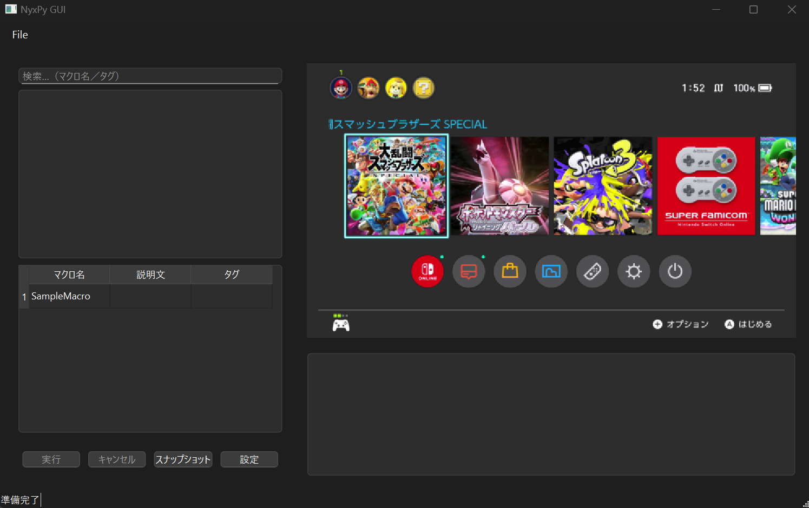

# Project NyX


NyX は、Nintendo Switch 向け自動化ツールの開発フレームワークです。PCに接続したキャプチャデバイスからゲーム画面を取得し、シリアル通信デバイスを介してコントローラー操作を自動化できます。

**注意: このソフトウェアは現在開発中のα版です。機能や設計が頻繁に変更される可能性があります。**



## 1. 概要

### 主な機能
- PySide6を使用したGUIインターフェース
- マクロの実行
- リアルタイム画面プレビュー
- スナップショット機能
- ログ出力・モニタリング
- キャプチャデバイス・シリアルデバイスの設定

### 必要なハードウェア
- **キャプチャデバイス**: Nintendo Switchの画面を取得するためのキャプチャカード/ボード
- **シリアル通信デバイス**: CH552プロトコルをサポートするコントロール送信デバイス

## 2. インストール

### 必要条件

- Python 3.12以上
- 対応OS: Windows/macOS/Linux
- 必要なハードウェア接続済み (キャプチャデバイス, シリアルデバイス)

このプロジェクトは Python のパッケージ管理に [uv](https://github.com/astral-sh/uv) を使用しています。


### 方法1: pip (一般ユーザー向け)

// TBA

### 方法2: uv (フレームワーク開発者向け)

1. uvをインストール:
   ```
   pip install uv
   ```

2. リポジトリをクローン:
   ```
   git clone https://github.com/niart120/Project_NyX.git
   cd Project_NyX
   ```

3. 依存関係をインストール:
   ```
   uv sync
   ```

4. GUIアプリケーションを起動:
   ```
   uv run nyx-gui
   ```


## 3. 使用方法

### GUIアプリケーションの起動

```
nyxpy gui
```

### 初回起動時

1. デバイス設定ダイアログが表示されます
2. キャプチャデバイスとシリアルデバイスを選択
3. デバイスが検出されない場合は、接続を確認して「Settings」メニューから再設定

### マクロの作成と実行

1. `macros/` フォルダにマクロを作成 (詳細は[マクロ開発ガイド(To Be Written)](#マクロ開発)参照)
2. GUIからマクロを選択
3. 実行ボタンをクリック
4. 必要に応じてパラメータを設定
5. ログペインでマクロの進行状況を確認

### プレビューとスナップショット

- 右側のペインにゲーム画面のリアルタイムプレビューが表示
- スナップショットボタンで現在のフレームを `snapshots/` フォルダに保存

### デバイス設定

- メニューの「File」→「Settings」から設定画面を開く
- キャプチャデバイス、FPS、シリアルデバイス、ボーレートを設定

## 4. マクロ開発

マクロは `macros/` フォルダに配置されたPythonスクリプトです。

### 基本的なマクロ構造

```python
from nyxpy.framework.core.macro.base import MacroBase

class SampleMacro(MacroBase):
    description = "マクロの説明"
    tags = ["タグ1", "タグ2"]
    
    def initialize(self, cmd, args):
        # 初期化処理
        pass
        
    def run(self, cmd):
        # メイン処理
        cmd.press(KeyType.A, dur=0.1)
        cmd.wait(1.0)
        # 例: 画面キャプチャ
        img = cmd.capture()
        # 例: キーボード入力
        cmd.keyboard("Hello")
        
    def finalize(self, cmd):
        # 後処理
        pass
```

### 主なコマンド

- `cmd.press(key, dur=0.1, wait=0.0)`: キーを押して離す
- `cmd.hold(key)`: キーを押しっぱなしにする
- `cmd.release(key)`: 押しっぱなしのキーを離す
- `cmd.wait(sec)`: 指定秒数待機
- `cmd.capture()`: スクリーンショット取得
- `cmd.log(message)`: ログ出力

詳細は `docs/macro_design.md` を参照ください。

## 5. 設定ファイル

`.nyxpy/settings.toml` に設定が保存されます。GUI上での変更は自動的に保存されます。

## 6. トラブルシューティング

### デバイスが認識されない場合
- デバイスのドライバが正常にインストールされているか確認
- 別のUSBポートに接続を試す
- スタートアップリストをクリアし、再試行

### プレビューが表示されない場合
- キャプチャデバイスが正常に機能しているか確認
- 設定ダイアログで別のデバイスを選択
- FPS設定を30に下げてみる

### マクロが動作しない場合
- ログを確認して具体的なエラーを特定
- シリアルデバイスの接続状態を確認
- 引数（パラメータ）が必要な場合は適切に設定

### クラッシュする場合
- ログファイル (`logs/logfile.log`) を確認
- Python および依存ライブラリのバージョンを確認
- GitHub Issuesで報告（ログを添付）

## 7. 今後の予定

- GUIの見直し
    - ログ表示機能の拡充
    - etc
- パフォーマンス最適化

## 8. ライセンス

このプロジェクトは [MIT License](LICENSE) の下でライセンスされています。

## 9. 貢献方法

フィードバックや貢献は大歓迎です！
- バグ報告や機能リクエストは GitHub Issues にお願いします
- コントリビューションは Pull Request で受け付けています

開発者向けの詳細なドキュメントは `docs/` ディレクトリを参照してください。
