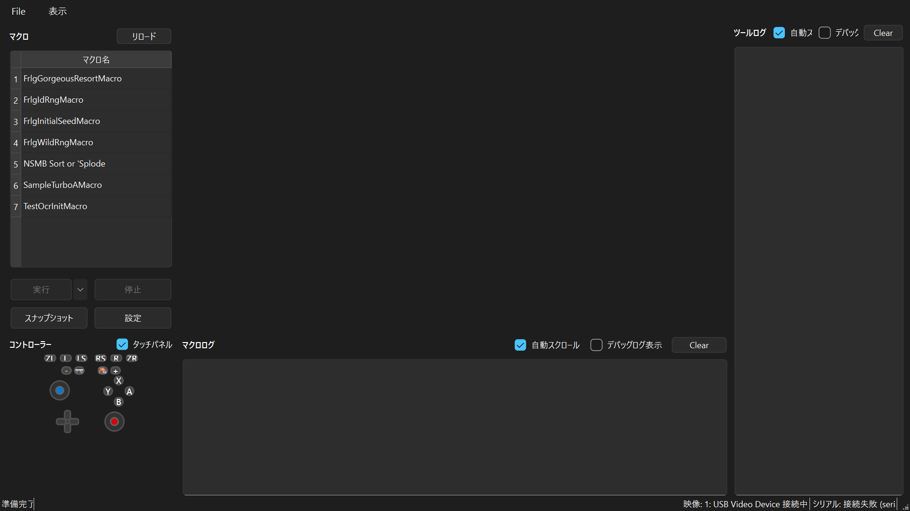

# Project NyX


NyX は、Nintendo Switch 向け自動化ツールの開発フレームワークです。PC に接続したキャプチャデバイスからゲーム画面を取得し、シリアル通信デバイスを介してコントローラー操作を自動化できます。

**注意: このソフトウェアは開発中のアルファ版です。機能や設計が変更される可能性があります。**



## 特徴

- PySide6 による GUI と `nyxpy` CLI
- キャプチャデバイスのリアルタイムプレビュー
- シリアル通信デバイス経由のコントローラー操作
- マクロ実行基盤
- 実行ログ、スナップショット、実行成果物の保存
- Discord / Bluesky への外部通知

## 必要なもの

- [uv](https://github.com/astral-sh/uv)
- 対応 OS: Windows / macOS / Linux
- キャプチャデバイス
- CH552 プロトコルなど NyX が対応するシリアル通信デバイス

## クイックスタート

配布パッケージ `nyxfw` は公開準備中です。公開後は次の導線を使います。

```console
uv tool install nyxfw
nyxpy init
nyxpy gui
```

現時点で動作確認する場合は、リポジトリを取得して起動します。

```console
git clone https://github.com/niart120/Project_NyX.git
cd Project_NyX
uv sync
uv run nyxpy init
uv run nyxpy gui
```

## ドキュメント

利用者向けガイド、マクロ開発者向けドキュメント、API リファレンスは GitHub Pages で公開しています。

- [Project NyX Docs](https://niart120.github.io/Project_NyX/)
- [利用者向けガイド](https://niart120.github.io/Project_NyX/user-guide/)
- [マクロ開発者向けドキュメント](https://niart120.github.io/Project_NyX/macro-development/)
- [API リファレンス](https://niart120.github.io/Project_NyX/api/framework/)

リポジトリ内の Markdown は次の場所にあります。

- [docs/user-guide/README.md](docs/user-guide/README.md)
- [docs/macro-development/README.md](docs/macro-development/README.md)
- [docs/api/framework.md](docs/api/framework.md)

## ライセンス

このプロジェクトは [MIT License](LICENSE) の下でライセンスされています。
