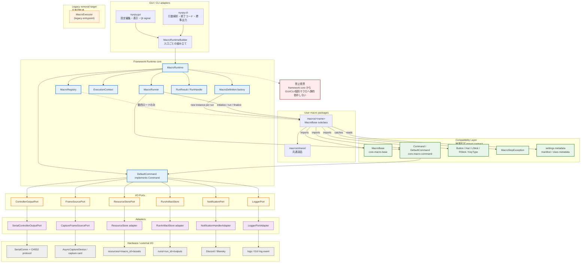
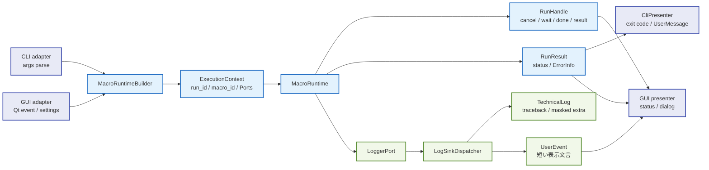

# フレームワーク再設計アーキテクチャ図 仕様書

> **文書種別**: 補助資料。図は `FW_REARCHITECTURE_OVERVIEW.md` の理解補助であり、実装仕様の正本は各図の参照先と関連仕様書である。
> **対象モジュール**: `src\nyxpy\framework\core\runtime\`, `src\nyxpy\framework\core\io\`, `src\nyxpy\framework\core\macro\`  
> **目的**: フレームワーク再設計における互換境界、Runtime 中核、Ports/Adapters、GUI/CLI、ハードウェア/外部 I/O の依存方向を Mermaid 図で固定する。  
> **関連ドキュメント**: `spec/framework/rearchitecture/FW_REARCHITECTURE_OVERVIEW.md`, `spec/framework/rearchitecture/RUNTIME_AND_IO_PORTS.md`, `spec/framework/rearchitecture/MACRO_COMPATIBILITY_AND_REGISTRY.md`, `spec/framework/rearchitecture/RESOURCE_FILE_IO.md`, `spec/framework/rearchitecture/LOGGING_FRAMEWORK.md`, `spec/framework/rearchitecture/OBSERVABILITY_AND_GUI_CLI.md`, `spec/framework/rearchitecture/DEPRECATION_AND_MIGRATION.md`
> **破壊的変更**: 破壊的変更と削除条件は `DEPRECATION_AND_MIGRATION.md` を正とする。本書は図版上の互換境界と依存方向だけを示す。

## 1. 概要

### 1.1 目的

Project NyX のフレームワーク再設計を、実装境界と依存方向が読み取れる Mermaid 図として明文化する。既存マクロが依存する import contract を破壊不可の境界として示し、`MacroRuntime`、Ports/Adapters、GUI/CLI、ハードウェア/外部 I/O の責務分担を図で固定する。

### 1.2 用語定義

| 用語 | 定義 |
|------|------|
| Import Contract | 既存マクロが import している `MacroBase`、`Command`、`DefaultCommand`、constants、`MacroStopException` を維持する契約。 |
| Compatibility Layer | import contract を守る互換層。`MacroExecutor`、旧 settings lookup、旧 Resource I/O は含めず、GUI/CLI/テストを新 Runtime 入口へ移行して削除する。 |
| MacroRuntime | マクロ実行要求、registry 解決、`definition.factory.create()`、runner 呼び出し、結果返却を統括する中核。context 生成は `MacroRuntimeBuilder` が担当する。 |
| MacroRegistry | マクロ定義、安定 ID、ロード診断を保持するレジストリ。実行インスタンスは保持しない。 |
| MacroFactory | `MacroDefinition` が所有する生成責務。実行ごとに新しい `MacroBase` インスタンスを返す。 |
| MacroRunner | `initialize -> run -> finalize` を実行し、成功・中断・失敗を `RunResult` に変換するコンポーネント。 |
| ExecutionContext | 1 回の実行に必要な run_id、macro_id、実行引数、Ports、CancellationToken、options をまとめる値。 |
| DefaultCommand | 既存 `Command` API と import path を維持し、実処理を Ports へ委譲する実装。追加の別 `Command` 実装クラスは置かない。 |
| Ports/Adapters | Port は Runtime 中核から見た I/O 抽象、Adapter は現行 Serial/Capture/Resource/Notification/Logger 実装へ接続する実装。 |
| RunResult | マクロ実行の終了状態、開始終了時刻、失敗情報、解放警告を保持する結果値。 |

### 1.3 背景・問題

既存仕様では Runtime、I/O Ports、マクロ互換、GUI/CLI、可観測性が個別文書で整理されている。一方、読み手が全体の依存方向を追うには複数文書を横断する必要があり、どこが既存マクロ互換の破壊不可境界で、どこが内部差し替え可能な領域かが一目で分かりにくい。

本仕様は、概念図ではなく実装判断に使う境界図を提供する。図は `nyxpy.framework.*` が GUI/CLI や個別マクロへ静的依存しない制約、Runtime が Ports を介してハードウェア/外部 I/O へ到達する制約、旧入口が残る場合も Runtime へ委譲する制約を示す。

### 1.4 期待効果

| 指標 | 現状 | 目標 |
|------|------|------|
| 再設計の全体把握 | 複数仕様の文章を横断して理解する | 1 つの全体レイヤー図で主要依存方向を把握できる |
| import contract の見落とし | 文章内の互換表を読む必要がある | 互換境界図で破壊不可領域を確認できる |
| Runtime 実行順序の認識 | 文章シーケンスと API 表を照合する | 実行フロー図で request から result までを追える |
| I/O 境界の理解 | Command と具象実装の関係が散在する | Port 図で controller/capture/resource/notification/logger の委譲先を確認できる |

### 1.5 着手条件

- `FW_REARCHITECTURE_OVERVIEW.md` の互換方針、Runtime 責務、段階移行を前提にする。
- `RUNTIME_AND_IO_PORTS.md` の Port 名、Adapter 名、`DefaultCommand(context=...)` 方針を前提にする。
- `MACRO_COMPATIBILITY_AND_REGISTRY.md` の Compatibility Contract を破壊不可境界として扱う。
- `OBSERVABILITY_AND_GUI_CLI.md` の GUI/CLI 入口、logging components、通知設定ソースの方針を反映する。

## 2. 対象ファイル

| ファイル | 変更種別 | 変更内容 |
|----------|----------|----------|
| `spec/framework/rearchitecture/ARCHITECTURE_DIAGRAMS.md` | 新規 | 再設計全体、Runtime 実行フロー、I/O Ports、互換境界の Mermaid 図を定義する。 |
| `spec/framework/rearchitecture/FW_REARCHITECTURE_OVERVIEW.md` | 変更 | 本仕様への参照と、最重要の全体依存図を追加する。 |

## 3. 設計方針

### アーキテクチャ上の位置づけ

本仕様は再設計仕様群の索引図である。詳細な API、例外、設定値、テスト項目は既存の各仕様を正とし、本仕様は依存方向と境界の読み違いを防ぐための補助資料として扱う。図と本文が矛盾した場合は、各図の参照先にある仕様本文を正とし、本書を更新する。

### 公開 API 方針

本仕様はコードの公開 API を追加しない。図で示す破壊不可の公開面は、既存マクロが参照する次の import contract である。

```python
from nyxpy.framework.core.macro.base import MacroBase
from nyxpy.framework.core.macro.command import Command, DefaultCommand
from nyxpy.framework.core.constants import Button, Hat, LStick, RStick, KeyType
from nyxpy.framework.core.macro.exceptions import MacroStopException
```

### 後方互換性

既存マクロは `MacroRuntime`、`MacroRegistry`、Ports を直接使う必要がない。マクロ作者に対して維持する互換条件は現行と同じ import path、`MacroBase.initialize(cmd, args)` / `run(cmd)` / `finalize(cmd)`、`Command` 公開メソッドである。settings と Resource I/O は manifest または class metadata の settings source と新リソース配置への移行対象である。

### レイヤー構成

- GUI/CLI は Runtime を呼ぶ上位 adapter である。
- 既存マクロは import contract へ依存する利用者コードである。
- Runtime 中核は registry、`definition.factory.create()`、runner、result を統括する。
- `DefaultCommand` は既存 `Command` API を維持し、I/O は Ports へ委譲する。
- Adapters は現行の Serial/Capture/Resource/Notification/Logger 実装へ接続する。
- ハードウェア/外部 I/O は最下流にあり、Runtime 中核へ逆依存しない。

### 性能要件

| 指標 | 目標値 |
|------|--------|
| Mermaid 図の表示 | GitHub Markdown 上で追加プラグインなしに表示できる |
| 仕様参照の導線 | Overview から本仕様へ 1 クリックで到達できる |
| 図の粒度 | 全体図、実行フロー、I/O Port、互換境界を分けて、1 図が複数責務を抱えない |

### 並行性・スレッド安全性

本仕様は文書追加であり、実行時のスレッドモデルを変更しない。図では `RunHandle` と GUI adapter の非同期境界を示すが、Runtime 本体に Qt 依存を入れない方針は `OBSERVABILITY_AND_GUI_CLI.md` を正とする。

## 4. 実装仕様

### 4.1 全体レイヤー図

GUI/CLI、既存マクロ、互換層、Runtime 中核、Ports/Adapters、ハードウェア/外部 I/O の依存方向を示す。実線は許可された呼び出し方向、点線は旧入口が残る場合の委譲、赤い境界は静的依存禁止の注記である。



| 分類 | 意味 |
|------|------|
| stable | 既存ユーザーマクロが import する破壊不可領域 |
| runtime | 再設計後の実行中核 |
| port | Runtime から見た I/O 抽象境界 |
| adapter | 現行実装や外部 I/O への接続実装 |
| io | ハードウェア、ファイル、外部サービスなどの具体 I/O |
| legacy | 最終構成では削除する旧実装 |
| guard | 静的依存禁止の境界 |

参照: [FW_REARCHITECTURE_OVERVIEW.md](FW_REARCHITECTURE_OVERVIEW.md)、[RUNTIME_AND_IO_PORTS.md](RUNTIME_AND_IO_PORTS.md)、[RESOURCE_FILE_IO.md](RESOURCE_FILE_IO.md)、[LOGGING_FRAMEWORK.md](LOGGING_FRAMEWORK.md)。

### 4.2 MacroRuntime 実行フロー

実行要求が registry、`definition.factory.create()`、context、runner、result へ流れる順序を示す。`MacroExecutor` は最終構成に含めず、GUI/CLI は Runtime 入口を直接使う。

```mermaid
flowchart LR
    Request["request<br/>GUI / CLI"]
    RegistryStep["registry<br/>MacroRegistry.resolve"]
    FactoryStep["factory<br/>definition.factory.create"]
    ContextStep["context<br/>ExecutionContext + Ports + token"]
    RunnerStep["runner<br/>MacroRunner.run"]
    Lifecycle["MacroBase lifecycle<br/>initialize -> run -> finalize"]
    ResultStep["result<br/>RunResult / RunHandle"]
    Cleanup["cleanup<br/>Port close / cleanup_warnings"]

    Request --> RegistryStep
    RegistryStep -->|MacroDefinition| FactoryStep
    FactoryStep -->|new MacroBase instance| ContextStep
    ContextStep -->|DefaultCommand(context=...)| RunnerStep
    RunnerStep --> Lifecycle
    Lifecycle -->|success / cancelled / failed| ResultStep
    RunnerStep --> ResultStep
    ResultStep --> Cleanup
    Cleanup -->|final result| Request

    classDef request fill:#e8eaf6,stroke:#3949ab,stroke-width:2px;
    classDef runtime fill:#e3f2fd,stroke:#1565c0,stroke-width:2px;
    classDef macro fill:#e8f5e9,stroke:#2e7d32,stroke-width:2px;
    classDef result fill:#fff3e0,stroke:#ef6c00,stroke-width:2px;

    class Request request;
    class RegistryStep,FactoryStep,ContextStep,RunnerStep runtime;
    class Lifecycle macro;
    class ResultStep,Cleanup result;
```

参照: [RUNTIME_AND_IO_PORTS.md](RUNTIME_AND_IO_PORTS.md)、[MACRO_COMPATIBILITY_AND_REGISTRY.md](MACRO_COMPATIBILITY_AND_REGISTRY.md)、[ERROR_CANCELLATION_LOGGING.md](ERROR_CANCELLATION_LOGGING.md)。

### 4.3 I/O Port 図

`DefaultCommand` から controller、capture、resource、artifact、notification、logger の各 Port へ分岐し、Adapter が現行実装または外部 I/O へ接続する。

```mermaid
flowchart TB
    DefaultCommandImpl["DefaultCommand<br/>既存 Command API"]

    subgraph PortLayer["Port layer"]
        Controller["ControllerOutputPort<br/>press / hold / release / keyboard / type_key"]
        Capture["FrameSourcePort<br/>initialize / await_ready / latest_frame"]
        Resource["ResourceStorePort<br/>resolve_asset_path / load_image"]
        Artifact["RunArtifactStore<br/>resolve_output_path / save_image / open_output"]
        Notify["NotificationPort<br/>publish"]
        Logger["LoggerPort<br/>log"]
        Touch["TouchInputCapability<br/>任意 capability"]
        Sleep["SleepControlCapability<br/>任意 capability"]
    end

    subgraph AdapterLayer["Adapter layer"]
        SerialPort["SerialControllerOutputPort"]
        DummyController["DummyControllerOutputPort<br/>allow_dummy=True only"]
        CapturePort["CaptureFrameSourcePort"]
        DummyFrame["DummyFrameSourcePort<br/>テスト・明示実行"]
        ResourceStore["ResourceStore adapter"]
        ArtifactStore["RunArtifactStore adapter"]
        NotificationHandlerAdapter["NotificationHandlerAdapter / NoopNotificationAdapter"]
        LoggerPortAdapter["LoggerPortAdapter"]
    end

    subgraph ConcreteIO["Concrete I/O"]
        SerialComm["SerialCommInterface"]
        Protocol["SerialProtocolInterface / CH552"]
        CaptureDevice["AsyncCaptureDevice / CaptureDeviceInterface"]
        AssetsRoot["resources/&lt;macro_id&gt;/assets<br/>read-only assets"]
        OutputsRoot["runs/&lt;run_id&gt;/outputs<br/>writable artifacts"]
        SettingsResolver["MacroSettingsResolver<br/>settings TOML 解決"]
        Discord["Discord"]
        Bluesky["Bluesky"]
        LoggerComponents["DefaultLogger<br/>LogSinkDispatcher<br/>LogBackend"]
    end

    DefaultCommandImpl --> Controller
    DefaultCommandImpl --> Capture
    DefaultCommandImpl --> Resource
    DefaultCommandImpl --> Artifact
    DefaultCommandImpl --> Notify
    DefaultCommandImpl --> Logger
    DefaultCommandImpl -. "touch*" .-> Touch
    DefaultCommandImpl -. "disable_sleep" .-> Sleep

    Controller --> SerialPort --> SerialComm --> Protocol
    Controller --> DummyController
    Touch -.-> SerialPort
    Sleep -.-> SerialPort
    Capture --> CapturePort --> CaptureDevice
    Capture --> DummyFrame
    Resource --> ResourceStore --> AssetsRoot
    Artifact --> ArtifactStore --> OutputsRoot
    ResourceStore -. "settings は扱わない" .-> SettingsResolver
    Notify --> NotificationHandlerAdapter --> Discord
    NotificationHandlerAdapter --> Bluesky
    Logger --> LoggerPortAdapter --> LoggerComponents

    classDef port fill:#fff8e1,stroke:#f57f17,stroke-width:2px;
    classDef adapter fill:#f3e5f5,stroke:#6a1b9a,stroke-width:1px;
    classDef io fill:#eeeeee,stroke:#424242,stroke-width:1px;
    classDef commandimpl fill:#e3f2fd,stroke:#1565c0,stroke-width:2px;

    class DefaultCommandImpl commandimpl;
    class Controller,Capture,Resource,Artifact,Notify,Logger,Touch,Sleep port;
    class SerialPort,DummyController,CapturePort,DummyFrame,ResourceStore,ArtifactStore,NotificationHandlerAdapter,LoggerPortAdapter adapter;
    class SerialComm,Protocol,CaptureDevice,AssetsRoot,OutputsRoot,SettingsResolver,Discord,Bluesky,LoggerComponents io;
```



| 分類 | 意味 |
|------|------|
| commandimpl | 既存 `Command` API を実装する `DefaultCommand` |
| port | `DefaultCommand` が依存する抽象境界 |
| adapter | Port を現行実装またはファイル配置へ接続する実装 |
| io | 実ファイル、デバイス、外部サービスなどの具体 I/O |

参照: [RUNTIME_AND_IO_PORTS.md](RUNTIME_AND_IO_PORTS.md)、[RESOURCE_FILE_IO.md](RESOURCE_FILE_IO.md)、[CONFIGURATION_AND_RESOURCES.md](CONFIGURATION_AND_RESOURCES.md)、[LOGGING_FRAMEWORK.md](LOGGING_FRAMEWORK.md)。

### 4.4 互換境界図

既存ユーザーマクロが依存してよい領域、内部差し替え可能な領域、削除対象 / 廃止候補領域を分ける。

```mermaid
flowchart TB
    subgraph User["User macro import contract"]
        UserCode["macros/&lt;name&gt;/macro.py"]
        ImportBase["from ...macro.base import MacroBase"]
        ImportCommand["from ...macro.command import Command / DefaultCommand"]
        ImportConstants["from ...constants import Button / Hat / LStick / RStick / KeyType"]
        ImportStop["from ...macro.exceptions import MacroStopException"]
        ManifestSettings["macro.toml / class metadata<br/>settings source"]
    end

    subgraph Stable["破壊不可領域"]
        MacroBaseContract["MacroBase<br/>initialize(cmd, args) / run(cmd) / finalize(cmd)"]
        CommandContract["Command methods<br/>press / wait / capture / notify / log など"]
        ConstantsContract["constants export"]
        StopContract["MacroStopException"]
        SettingsResolverContract["MacroSettingsResolver<br/>explicit settings only"]
    end

    subgraph Replaceable["内部差し替え可能領域"]
        Runtime["MacroRuntime"]
        Registry["MacroRegistry"]
        Factory["MacroDefinition.factory"]
        Runner["MacroRunner"]
        CommandImpl["DefaultCommand"]
        Ports["Ports / Adapters"]
    end

    subgraph Deprecated["削除対象 / 廃止候補領域"]
        Executor["MacroExecutor<br/>旧 GUI/CLI/テスト入口"]
        LegacyLoader["旧 auto discovery"]
        CwdFallback["cwd fallback"]
        SysPath["恒久的な sys.path 変更"]
        DummyFallback["暗黙 dummy fallback"]
        AmbiguousClass["曖昧な class 名選択"]
    end

    UserCode --> ImportBase --> MacroBaseContract
    UserCode --> ImportCommand --> CommandContract
    UserCode --> ImportConstants --> ConstantsContract
    UserCode --> ImportStop --> StopContract
    UserCode --> ManifestSettings --> SettingsResolverContract

    Runner --> MacroBaseContract
    CommandImpl --> CommandContract
    Registry --> SettingsResolverContract
    Runtime --> Registry
    Runtime --> Factory
    Runtime --> Runner
    CommandImpl --> Ports

    Executor -. "削除前に参照を移行" .-> Runtime
    LegacyLoader -. "manifest / convention discovery へ移行" .-> Registry
    CwdFallback -. "削除" .-> Registry
    SysPath -. "削除候補" .-> LegacyLoader
    DummyFallback -. "allow_dummy=True へ移行" .-> Ports
    AmbiguousClass -. "Qualified Macro ID へ移行" .-> Registry

    classDef stable fill:#e8f5e9,stroke:#2e7d32,stroke-width:2px;
    classDef replaceable fill:#e3f2fd,stroke:#1565c0,stroke-width:2px;
    classDef deprecated fill:#ffebee,stroke:#c62828,stroke-width:2px;
    classDef user fill:#fffde7,stroke:#f9a825,stroke-width:1px;

    class UserCode,ImportBase,ImportCommand,ImportConstants,ImportStop,StaticSettings user;
    class MacroBaseContract,CommandContract,ConstantsContract,StopContract,SettingsContract stable;
    class Runtime,Registry,Factory,Runner,CommandImpl,Ports replaceable;
    class Executor,LegacyLoader,CwdFallback,SysPath,DummyFallback,AmbiguousClass deprecated;
```



参照: [MACRO_COMPATIBILITY_AND_REGISTRY.md](MACRO_COMPATIBILITY_AND_REGISTRY.md)、[DEPRECATION_AND_MIGRATION.md](DEPRECATION_AND_MIGRATION.md)、[MACRO_MIGRATION_GUIDE.md](MACRO_MIGRATION_GUIDE.md)。

### 4.5 GUI/CLI と可観測性の境界

GUI/CLI は Runtime の利用者であり、結果や表示イベントを自身の出力へ変換する。Runtime 本体は Qt、argparse、標準出力へ依存しない。



参照: [OBSERVABILITY_AND_GUI_CLI.md](OBSERVABILITY_AND_GUI_CLI.md)、[LOGGING_FRAMEWORK.md](LOGGING_FRAMEWORK.md)、[RUNTIME_AND_IO_PORTS.md](RUNTIME_AND_IO_PORTS.md)。

### 設定パラメータ

| パラメータ | 型 | デフォルト | 説明 |
|------------|-----|-----------|------|
| 該当なし | なし | なし | 本仕様は文書追加のみであり、実行時設定を追加しない。 |

### エラーハンドリング

| 例外クラス | 発生条件 |
|------------|----------|
| 該当なし | 本仕様は文書追加のみであり、実行時例外を追加しない。 |

### シングルトン管理

本仕様はシングルトンを追加しない。`MacroRuntime`、`MacroRegistry`、logging components、既存 manager shim の管理方針は各詳細仕様を正とする。

## 5. テスト方針

| テスト種別 | テスト名 | 検証内容 |
|------------|----------|----------|
| ドキュメント | `test_architecture_diagrams_has_required_sections` | 本仕様に必須 6 セクションが存在することを確認する。 |
| ドキュメント | `test_architecture_diagrams_has_mermaid_blocks` | Mermaid コードブロックが 4 つ以上存在することを確認する。 |
| ドキュメント | `manual_mermaid_render_check` | GitHub Web UI で Mermaid 図が描画できることを手動確認する。 |
| ドキュメント | `test_architecture_diagrams_keep_import_contract` | `MacroBase`、`Command`、`DefaultCommand`、constants、`MacroStopException` が互換境界として記載されていることを確認する。 |
| ドキュメント | `test_architecture_diagrams_match_canonical_specs` | 各図の参照先仕様と主要ノード名が同期していることを確認する。 |
| ドキュメント | `git_diff_check` | `git diff --check` で Markdown の空白エラーがないことを確認する。 |
| ドキュメント | `placeholder_scan` | 対象 2 ファイルに未確定プレースホルダが残っていないことを確認する。 |

## 6. 実装チェックリスト

本仕様は文書追加であり、実装タスクは発生しない。図版作成と正本仕様との同期確認を本チェックリストで扱う。

### 6.1 図版作成チェックリスト

- [x] 関連 4 仕様を読み、Runtime、Ports、互換境界、GUI/CLI の責務を反映
- [x] 全体レイヤー図を Mermaid で作成
- [x] MacroRuntime 実行フロー図を Mermaid で作成
- [x] I/O Port 図を Mermaid で作成
- [x] 互換境界図を Mermaid で作成
- [x] GUI/CLI と可観測性の境界図を Mermaid で作成
- [x] 既存マクロの import contract を破壊不可境界として表示
- [x] Overview から参照できる構成にする
- [x] Mermaid 構文と正本仕様との同期確認項目をテスト方針に追加
