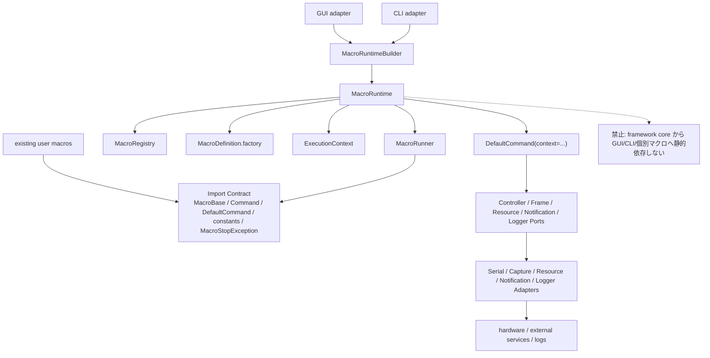

# フレームワーク再設計仕様書

> **文書種別**: 仕様書。再設計全体の方針と仕様依存関係を定義し、詳細 API の正本は下記の所有文書へ委譲する。
> **対象モジュール**: `src\nyxpy\framework\core\macro\` および将来追加する `src\nyxpy\framework\core\runtime\`  
> **目的**: 既存マクロ資産の import 互換を維持しながら、マクロ発見・生成・実行・中断・結果取得を `MacroRuntime` 中心に再整理する。  
> **関連ドキュメント**: `.github/skills/framework-spec-writing/template.md`, `spec/framework/archive/architecture.md`, `ARCHITECTURE_DIAGRAMS.md`, `DEPRECATION_AND_MIGRATION.md`, `RESOURCE_FILE_IO.md`, `LOGGING_FRAMEWORK.md`, `RUNTIME_AND_IO_PORTS.md`, `OBSERVABILITY_AND_GUI_CLI.md`
> **既存ソース**: `src\nyxpy\framework\core\macro\base.py`, `src\nyxpy\framework\core\macro\command.py`, `src\nyxpy\framework\core\macro\executor.py`, `src\nyxpy\framework\core\singletons.py`, `src\nyxpy\cli\run_cli.py`, `src\nyxpy\gui\main_window.py`  
> **破壊的変更**: `MacroBase` / `Command` / `DefaultCommand` / constants / `MacroStopException` の import と lifecycle は維持する。Resource I/O、settings lookup、`DefaultCommand` 旧コンストラクタ、legacy loader はマクロ側移行を前提に破壊的変更を許容する。

## 1. 概要

### 1.1 目的

NyX フレームワークのマクロ実行基盤を、既存マクロが import する `MacroBase` / `Command` / `DefaultCommand` / constants / `MacroStopException` を維持しながら `MacroRuntime` 中心の構成へ移行する。Resource I/O と settings lookup は旧 `static` 互換を残さず、新配置と manifest / class metadata / convention による明示的な解決へ寄せる。`MacroExecutor` は既存ユーザーマクロの公開互換契約、新 Runtime API、移行 adapter のいずれにも含めず、GUI/CLI/テストの参照をなくしたうえで削除する。

### 1.2 用語定義

| 用語 | 定義 |
|------|------|
| MacroBase | ユーザー定義マクロの抽象基底クラス。現行 import `nyxpy.framework.core.macro.base.MacroBase` と `initialize(cmd, args)` / `run(cmd)` / `finalize(cmd)` のシグネチャを維持する。 |
| Command | マクロがコントローラー操作・画面キャプチャ・画像入出力・ログ・通知・中断を行うための高レベル API。現行 import `nyxpy.framework.core.macro.command.Command` を維持する。 |
| DefaultCommand | 現行 `Command` の標準実装 import path。再設計後は `ExecutionContext` を受け取り、Ports へ委譲する具象 `Command` 実装とする。旧コンストラクタ引数は受け付けない。 |
| MacroExecutor | 現行のマクロ発見・選択・実行クラス。再設計では公開 API・既存マクロ互換契約・移行 adapter に含めず、GUI/CLI/テストの参照を解消して削除する。 |
| MacroRuntime | 完成済み `ExecutionContext` を受け取り、同期実行、非同期実行、結果取得を統括する新しい実行中核。GUI・CLI は `MacroRuntimeBuilder` 経由で利用する。 |
| MacroRegistry | `macros` ディレクトリから `MacroBase` 継承クラスを発見し、マクロ定義情報を保持するコンポーネント。マクロの実行インスタンスは保持しない。 |
| MacroDefinition | 1 件のマクロを表す唯一の Python メタデータ型。安定 ID、module/class、表示名、説明、タグ、settings path、reload 時点の class object を持つ factory を保持する。 |
| MacroFactory | `MacroDefinition` が所有する生成責務。reload 時に import した class object を snapshot として保持し、実行ごとに新しい `MacroBase` インスタンスを返す。実行時の再 import は行わない。 |
| MacroRunner | `initialize -> run -> finalize` のライフサイクルを実行し、例外・中断・結果を `RunResult` に変換するコンポーネント。 |
| RunHandle | 非同期実行中のマクロに対する操作ハンドル。中断要求、完了待ち、結果取得、状態確認を提供する。 |
| RunResult | マクロ実行の結果値。`macro_id`、`macro_name`、`RunStatus(StrEnum)`、`datetime` の開始・終了時刻、`ErrorInfo | None`、`cleanup_warnings`、`ok`、`duration_seconds` を保持する。正本は `RUNTIME_AND_IO_PORTS.md` であり、生成責務は `MacroRunner` が持つ。 |
| ErrorInfo | 失敗・中断理由を GUI/CLI へ渡すための構造化エラー情報。秘密情報と traceback の表示先を分離する。 |
| ExecutionContext | 1 回のマクロ実行に必要な `run_id`、`macro_id`、`macro_name`、`RunLogContext`、Ports、`CancellationToken`、`RuntimeOptions`、`exec_args`、`metadata` をまとめる値オブジェクト。`Command` は保持しない。 |
| RunContext | `MacroRunner` が `RunResult` を組み立てるための実行時刻、run_id、macro_id、macro_name、token、logger を保持する内部値。 |
| RunLogContext | ログ相関情報。型定義は `LOGGING_FRAMEWORK.md`、所有場所は `RUNTIME_AND_IO_PORTS.md` の `ExecutionContext.run_log_context` を正とする。 |
| MacroSettingsResolver | manifest または class metadata で明示された settings source を解決する専用コンポーネント。画像保存用の `ResourceStorePort` とは分離する。 |
| Ports/Adapters | フレームワーク中核がハードウェア、設定、通知、時刻、スレッド、GUI/CLI に直接依存しないための境界。Port は抽象、Adapter は現行実装への接続である。 |
| Compatibility Layer | 既存マクロが import する公開面を壊さないための互換層。対象は `MacroBase` / `Command` / `DefaultCommand` / constants / `MacroStopException` に限定し、旧 settings lookup、旧 `DefaultCommand` コンストラクタ、`MacroExecutor` は含めない。 |
| CancellationToken | `Command` の中断判定に使うスレッドセーフな中断メカニズム。再設計後の `Command.stop()` は停止要求だけを登録し、即時例外は送出しない。 |
| MacroStopException | マクロ中断を表す既存例外。再設計後も既存マクロと既存 GUI/CLI の catch 対象として維持する。 |

#### 1.2.1 正本ドキュメント

| 概念 | 正本ドキュメント | 参照側の扱い |
|------|------------------|--------------|
| `RunResult` / `RunHandle` / `ExecutionContext` / `RuntimeOptions` | `RUNTIME_AND_IO_PORTS.md` | 他仕様では再定義せず、生成・参照タイミングだけを記述する |
| `ErrorInfo` / `ErrorKind` / `FrameworkValue` / `MacroStopException` | `ERROR_CANCELLATION_LOGGING.md` | Runtime / Logging / GUI/CLI 仕様は型を参照し、別名の error code や value 型を定義しない |
| `LoggerPort` / `RunLogContext` / `UserEvent` / `TechnicalLog` | `LOGGING_FRAMEWORK.md` | Runtime は `ExecutionContext.run_log_context` と `LoggerPort` の注入だけを定義する |
| `MacroResourceScope` / `ResourceStorePort` / `RunArtifactStore` / `ResourcePathGuard` | `RESOURCE_FILE_IO.md` | Runtime は Store の生成順と `ExecutionContext` への注入だけを定義する |
| `SettingsStore` / `SecretsStore` / `MacroSettingsResolver` | `CONFIGURATION_AND_RESOURCES.md` | GUI / CLI composition root が読み込み、Registry / Runtime は読み込み結果と secrets snapshot を受け取る |
| `MacroRegistry` / `MacroDefinition` / `MacroFactory` | `MACRO_COMPATIBILITY_AND_REGISTRY.md` | Runtime は `MacroDefinition.factory` を実行ごとに使う |

### 1.3 背景・問題

#### 現行コードから確認した事実

- `MacroBase` は `description` / `tags` のメタデータと、`initialize(cmd, args)` / `run(cmd)` / `finalize(cmd)` の抽象メソッドを持つ。
- `Command` は `press`、`hold`、`release`、`wait`、`stop`、`log`、`capture`、`save_img`、`load_img`、`keyboard`、`type`、`notify`、`touch`、`touch_down`、`touch_up`、`disable_sleep` を公開している。
- `DefaultCommand` は `SerialCommInterface`、`CaptureDeviceInterface`、`StaticResourceIO`、`SerialProtocolInterface`、`CancellationToken`、`NotificationHandler` を受け取り、マクロ用操作を実行する。
- `MacroExecutor` は `Path.cwd() / "macros"` を探索し、`MacroBase` 継承クラスを import してインスタンス化し、`self.macros` に保持する。
- `MacroExecutor.execute()` は `load_macro_settings()` の結果と実行引数をマージし、`initialize -> run -> finalize` を呼ぶ。例外発生時も `finalize()` は呼ばれる。
- `singletons.py` は `serial_manager`、`capture_manager`、`global_settings`、`secrets_settings` をグローバルに生成し、`initialize_managers()` と `reset_for_testing()` を提供する。
- CLI と GUI はそれぞれ `DefaultCommand` を組み立て、`MacroExecutor` へ渡して実行する。GUI は `QThread` の `WorkerThread` で実行し、中断時は `cmd.stop()` を呼ぶ。

#### 問題

- マクロ発見、実行インスタンス生成、ライフサイクル実行、GUI/CLI の実行制御が `MacroExecutor`、CLI、GUI、`DefaultCommand` に分散している。
- 現行 `MacroExecutor` は発見時にマクロをインスタンス化するため、マクロが内部状態を持つ場合に実行間状態が残りやすい。
- GUI と CLI が `DefaultCommand` の構築手順をそれぞれ持つため、デバイス、プロトコル、通知、中断トークンの組み合わせ方が重複している。
- `singletons.py` のグローバル状態に GUI/CLI/Command が強く依存しており、実機なしの単体テストと並列テストを組みにくい。
- 既存マクロ資産は import パスに強く依存しているため、再設計で最初に守るべき制約は設計の純粋性ではなく import 互換である。

### 1.4 期待効果

| 指標 | 現状 | 目標 |
|------|------|------|
| 既存 import 破壊件数 | 変更次第で発生しうる | `MacroBase` / `Command` / `DefaultCommand` / constants / `MacroStopException` は 0 件 |
| マクロ実行ごとのインスタンス分離 | `MacroExecutor.reload_macros()` 時に生成したインスタンスを再利用 | `MacroFactory` が実行ごとに新規生成 |
| GUI/CLI の `DefaultCommand` 構築箇所 | CLI と GUI に重複 | `ExecutionContext` 生成 adapter に集約 |
| 実機不要の実行基盤単体テスト | `MacroExecutor` と singleton 依存の影響を受ける | Dummy Port / Adapter で `MacroRegistry`、`MacroFactory`、`MacroRunner`、`MacroRuntime` を検証 |
| 非同期実行の結果表現 | GUI の `finished` 文字列に依存 | `RunHandle` と `RunResult` で成功・中断・失敗を表現 |
| 段階移行時の GUI/CLI 変更量 | 実行構築と画面制御が混在 | 既存 import を残した adapter 置換に限定 |

### 1.5 着手条件

- 現行コードを正とし、`spec/framework/archive/architecture.md` は参考資料として扱う。
- 既存マクロが使う `nyxpy.framework.core.macro.base.MacroBase` と `nyxpy.framework.core.macro.command.Command` の import を維持する。
- `nyxpy.framework.core.macro.command.DefaultCommand`、constants、`MacroStopException` を互換対象として扱う。旧 settings lookup は互換契約に含めず、manifest / class metadata / settings なしの解決順と `exec_args` merge の契約を新たに固定する。
- 新 runtime を導入する前に、既存 import 互換テストを追加する。
- 実装着手時は `uv run pytest tests\unit\` が既存ベースラインとして通ることを確認する。
- GUI/CLI の置換は `MacroRuntime` の同期実行・非同期実行・中断・結果取得が単体テストで固定された後に行う。

### 1.6 仕様依存関係

詳細な型定義、責務、テスト期待値は次の所有文書を正とする。Overview は判断の入口であり、表内の概念を重複定義しない。

| 概念 | 正とする文書 | 参照元 | 変更時に同期すべき文書 |
|------|--------------|--------|------------------------|
| 既存マクロ互換契約 | `MACRO_COMPATIBILITY_AND_REGISTRY.md` | Overview, Implementation Plan, Test Strategy | Deprecation, Runtime |
| `MacroRegistry` / `MacroDefinition` / manifest 任意採用 | `MACRO_COMPATIBILITY_AND_REGISTRY.md` | Overview, Runtime, Implementation Plan, Test Strategy | Configuration, Deprecation |
| `MacroRuntime` / `MacroRuntimeBuilder` / Ports / `ExecutionContext` / `RunResult` / `RunHandle` | `RUNTIME_AND_IO_PORTS.md` | Overview, Error/Cancellation, Observability, Test Strategy | Implementation Plan, Logging |
| `RunLogContext` / logging event 名 / sink 契約 | `LOGGING_FRAMEWORK.md` | Error/Cancellation, Observability, Runtime | Test Strategy |
| error code / 例外から `RunResult` への正規化 | `ERROR_CANCELLATION_LOGGING.md` | Runtime, Logging, Observability | Configuration, Test Strategy |
| settings lookup / `MacroSettingsResolver` | `CONFIGURATION_AND_RESOURCES.md` | Macro Compatibility, Runtime, Resource File I/O | Implementation Plan |
| Resource File I/O / `MacroResourceScope` / artifact store | `RESOURCE_FILE_IO.md` | Runtime, Configuration, Test Strategy | Implementation Plan |
| GUI/CLI adapter / 終了コード / Qt 境界 | `OBSERVABILITY_AND_GUI_CLI.md` | Overview, Runtime, Logging | Implementation Plan, Test Strategy |
| 廃止・削除対象 | `DEPRECATION_AND_MIGRATION.md` | Overview, Implementation Plan, Test Strategy | Macro Compatibility |
| テスト分類と性能測定 | `TEST_STRATEGY.md` | 全仕様 | Implementation Plan |

### 1.7 パス表記規則

Markdown リンクとリポジトリ内の参照 path は `/` を使う。Windows 配置例や PowerShell コマンド例では `\` を使う。`macro.toml`、class metadata、settings などファイル内に永続化する path 文字列は portable path として `/` を使い、実ファイルパスへの変換は resolver が担当する。`Command.load_img()` / `save_img()` など実行時 Resource File I/O の path 引数は Windows path を許容し、path guard で root 外参照、drive 指定、UNC、予約名を拒否する。

## 2. 対象ファイル

現時点の作業対象は本仕様書のみである。以下の表は、本仕様が想定する段階移行の実装対象を含む。

| ファイル | 変更種別 | 変更内容 |
|----------|----------|----------|
| `spec/framework/rearchitecture/FW_REARCHITECTURE_OVERVIEW.md` | 新規 | フレームワーク再設計方針、互換方針、実装仕様、テスト方針を定義する。 |
| `src\nyxpy\framework\core\runtime\__init__.py` | 新規 | `MacroRuntime`、`MacroRunner`、`RunHandle`、`RunResult`、`ExecutionContext` を公開する。 |
| `src\nyxpy\framework\core\runtime\context.py` | 新規 | `ExecutionContext`, `RunContext`, `RuntimeOptions` を定義する。`ExecutionContext` は `Command` を持たない。 |
| `src\nyxpy\framework\core\runtime\result.py` | 新規 | `RunStatus`, `ErrorInfo`, `RunResult` を定義する。 |
| `src\nyxpy\framework\core\runtime\handle.py` | 新規 | `RunHandle` とスレッド実装を定義する。 |
| `src\nyxpy\framework\core\runtime\runner.py` | 新規 | `MacroBase` と `Command` を受け、ライフサイクル実行と `RunResult` 生成だけを担当する。 |
| `src\nyxpy\framework\core\runtime\runtime.py` | 新規 | registry 解決、`definition.factory.create()`、`DefaultCommand(context=...)` 生成、Port close を担当する。 |
| `src\nyxpy\framework\core\macro\registry.py` | 新規 | `MacroRegistry`, `MacroDefinition`, `MacroFactory` を定義する正配置。`macro.toml` は入力フォーマットとして扱う。 |
| `src\nyxpy\framework\core\macro\settings_resolver.py` | 新規 | `MacroSettingsResolver` を定義し、設定 TOML 解決を画像リソース I/O から分離する。 |
| `src\nyxpy\framework\core\macro\base.py` | 変更 | import パスと `MacroBase` シグネチャを維持する。初期段階では定義を移動しない。移動する場合も re-export と互換テストを先に置く。 |
| `src\nyxpy\framework\core\macro\command.py` | 変更 | `Command` / `DefaultCommand` の import パスと公開メソッドを維持する。内部依存だけを Ports/Adapters に寄せる。 |
| `src\nyxpy\framework\core\macro\executor.py` | 削除 | GUI/CLI/テストの参照を `MacroRuntime` / `MacroRegistry` へ移行した後に削除する。import 互換 shim は作らない。 |
| `src\nyxpy\framework\core\singletons.py` | 変更 | 互換 shim だけを残し、新 Runtime 経路からの直接参照を削除する。 |
| `src\nyxpy\cli\run_cli.py` | 変更 | `MacroRuntime` を使う CLI adapter へ移行し、`MacroExecutor` 参照を削除する。 |
| `src\nyxpy\gui\main_window.py` | 変更 | `MacroRuntime.start()` と `RunHandle` を使う GUI adapter へ移行し、`MacroExecutor` 参照を削除する。 |
| `tests\unit\framework\macro\test_import_contract.py` | 新規 | `MacroBase`、`Command`、`DefaultCommand`、constants、`MacroStopException` の import 互換と主要シグネチャを検証する。 |
| `tests\unit\framework\runtime\test_macro_registry.py` | 新規 | マクロ探索、reload、パッケージ型マクロ、import キャッシュ削除を検証する。 |
| `tests\unit\framework\runtime\test_macro_factory.py` | 新規 | 実行ごとに新規 `MacroBase` インスタンスが生成されることを検証する。 |
| `tests\unit\framework\runtime\test_macro_runner.py` | 新規 | 正常終了、中断、例外、`finalize()` 呼び出し保証、`RunResult` を検証する。 |
| `tests\unit\framework\runtime\test_execution_context.py` | 新規 | `ExecutionContext` と adapter が `Command`、設定、通知、中断トークンを正しく束ねることを検証する。 |
| `tests\integration\test_macro_runtime_entrypoints.py` | 新規 | GUI/CLI/テスト入口が `MacroExecutor` を import せず `MacroRuntime` / `MacroRegistry` を使うことを検証する。 |
| `tests\integration\test_cli_runtime_adapter.py` | 新規 | CLI adapter が既存引数から `ExecutionContext` を作り、runtime 実行へ接続できることを検証する。 |
| `tests\gui\test_main_window_runtime_adapter.py` | 新規 | GUI adapter が `RunHandle` の完了・中断・失敗を既存 UI 状態へ反映することを検証する。 |
| `tests\hardware\test_macro_runtime_realdevice.py` | 新規 | 実機接続時の runtime 実行、シリアル送信、キャプチャ取得を `@pytest.mark.realdevice` で検証する。 |
| `tests\perf\test_macro_discovery_perf.py` | 新規 | マクロ探索と reload が既存規模で許容時間内に収まることを検証する。 |

## 3. 設計方針

### 3.1 アーキテクチャ上の位置づけ

#### 提案する構成

```text
nyxpy.cli / nyxpy.gui
  -> CLI Adapter / GUI Adapter
    -> MacroRuntime
      -> MacroRegistry (`core.macro.registry`)
      -> MacroDefinition.factory
      -> DefaultCommand(context=...) 生成
      -> MacroRunner
        -> MacroBase
        -> Command
          -> Ports
            -> Adapters
              -> Serial adapter / Capture adapter / ProtocolFactory / ResourceStore / NotificationHandler / LoggerPort

Compatibility Layer
  -> nyxpy.framework.core.macro.base.MacroBase
  -> nyxpy.framework.core.macro.command.Command
  -> nyxpy.framework.core.macro.command.DefaultCommand
  -> nyxpy.framework.core.macro.exceptions.MacroStopException
```

詳細な図は [ARCHITECTURE_DIAGRAMS.md](ARCHITECTURE_DIAGRAMS.md) を参照する。最重要の依存方向は、GUI/CLI と既存マクロが上位利用者であり、Runtime 中核が Ports/Adapters を介してハードウェア/外部 I/O へ到達することである。



`MacroRuntime` は完成済み `ExecutionContext` を受け取る実行中核である。registry 解決、`definition.factory.create()` によるマクロ生成、`DefaultCommand(context=...)` 生成、Port close だけを担当し、Ports 準備と `ExecutionContext` 生成は `MacroRuntimeBuilder` へ委譲する。`initialize -> run -> finalize` と `RunResult` 生成は `MacroRunner` へ委譲する。GUI と CLI は実行中核ではなく、入力値の受け取り、進捗表示、終了表示、設定反映を担当する adapter である。フレームワーク層は GUI へ依存せず、GUI は `RunHandle` と `RunResult` を Qt の signal に変換する。

### 3.2 公開 API 方針

#### 維持する import と移行対象

| import | 方針 |
|--------|------|
| `from nyxpy.framework.core.macro.base import MacroBase` | 必ず維持する。シグネチャも維持する。 |
| `from nyxpy.framework.core.macro.command import Command` | 必ず維持する。既存マクロが呼ぶ公開メソッドを削除しない。 |
| `from nyxpy.framework.core.macro.command import DefaultCommand` | import path は維持する。旧コンストラクタ引数は互換対象外とし、`context` 必須にする。 |
| `from nyxpy.framework.core.macro.executor import MacroExecutor` | 公開互換契約から外す。`reload_macros()` / `set_active_macro()` / `execute()` / `macros` / `macro` は保証せず、GUI/CLI/テスト移行後に削除する。 |
| `from nyxpy.framework.core.macro.exceptions import MacroStopException` | 維持する。中断の catch 対象を変えない。 |

#### 新規 API

正 API の概要は本 Overview の 4.1.2 に置き、詳細な Runtime / Port API は `RUNTIME_AND_IO_PORTS.md` を正とする。詳細な Port とエラー仕様は `RUNTIME_AND_IO_PORTS.md` と `ERROR_CANCELLATION_LOGGING.md` を正とする。Resource File I/O の配置・path guard・atomic write は `RESOURCE_FILE_IO.md`、sink・backend・ログ保持・GUI 表示イベントは `LOGGING_FRAMEWORK.md` を正とする。新規コードは `nyxpy.framework.core.runtime` を優先して参照するが、`MacroRegistry` の正配置は `src\nyxpy\framework\core\macro\registry.py` である。既存マクロには Resource I/O と settings の移行を要求するが、マクロ作者に `MacroRuntime` 利用は強制しない。

#### 互換ポリシー

| 区分 | 対象 | 方針 |
|------|------|------|
| 永久維持 | `MacroBase` / `Command` / `DefaultCommand` import path、constants import、`MacroBase.initialize(cmd, args)` / `run(cmd)` / `finalize(cmd)`、`Command` 公開メソッド、`MacroStopException()` / `MacroStopException("stop")` | Runtime 再設計後も維持する。ただし `Command.stop()` はメソッド名と呼び出し可能性だけを維持し、即時例外送出の意味論は維持しない。 |
| 削除対象 | `MacroExecutor` | 既存マクロ互換 API ではない。GUI/CLI/テストを `MacroRuntime` / `RunHandle` / `MacroRegistry` へ移行した時点で削除し、import 互換 shim は作らない。 |
| 破壊的変更 | Resource I/O の `static` 互換、settings lookup の `static` / `cwd` fallback、`DefaultCommand` 旧コンストラクタ、legacy loader 自動探索 | マクロ移行ガイドに従ってマクロ側を修正する。 |
| 削除対象 | 暗黙 dummy fallback、恒久的な `sys.path` 変更、`cwd` 起点だけに依存する探索、settings path の曖昧解決 | 新 Runtime 経路では残さない。 |

廃止候補の削除条件、代替 API、互換影響、テストゲート、移行順は `DEPRECATION_AND_MIGRATION.md` を正とする。`MacroBase`、`Command`、`DefaultCommand`、constants、`MacroStopException` は廃止候補に含めない。

### 3.3 後方互換性

#### 段階移行

| 段階 | 内容 | 互換性の扱い |
|------|------|--------------|
| Phase 0 | import/signature 互換テストを追加する。 | 実装変更前に `MacroBase` / `Command` / `DefaultCommand` / constants / `MacroStopException` / settings source 解決順と `exec_args` merge の契約を固定する。 |
| Phase 1 | `core.macro.registry` の `MacroRegistry` / `MacroFactory` / `MacroSettingsResolver` を導入する。 | `MacroExecutor` を使わず、GUI/CLI/テストから `MacroRegistry` を直接参照できる入口を用意する。 |
| Phase 2 | `MacroRunner` を導入し、`initialize -> run -> finalize`、`RunResult`、`MacroStopException` 正規化を固定する。 | `MacroBase.finalize(cmd)` を唯一の抽象契約として維持し、outcome は opt-in にする。 |
| Phase 3 | `RunResult` / cancellation / finalize outcome opt-in を GUI/CLI へ渡せる形にする。 | `MacroRunner` が `RunResult` を生成し、GUI/CLI は例外再送出や `None` 戻り値へ依存しない。 |
| Phase 4 | GUI/CLI/テストの `MacroExecutor` 参照を `MacroRuntime` / `RunHandle` / `MacroRegistry` へ置換する。 | 置換完了後に `MacroExecutor` を削除する。 |
| Phase 5 | Ports / `DefaultCommand(context=...)` を導入し、`DefaultCommand` 内部を Port 委譲へ移行する。 | `Command.type(key: KeyCode \| SpecialKeyCode)` を単キー入力 API として維持し、文字列入力は `Command.keyboard(text: str)` に限定する。`Command.stop()` は協調キャンセル優先へ変更するため移行対象として扱う。 |
| Phase 6 | CLI を Runtime adapter へ移行する。 | 通知設定ソースは secrets snapshot に統一し、終了コードは `RunResult` から決める。 |
| Phase 7 | GUI を Runtime adapter へ移行する。 | `RunHandle` と GUI log event を Qt 層で変換し、core 層に Qt 依存を入れない。 |

既存ユーザーマクロ互換 API を非推奨化する場合は即削除しない。`MacroExecutor` は互換 API ではないため、非推奨期間や import shim を設けず、参照解消後に削除する。

### 3.4 レイヤー構成

#### 依存方向

```text
macros\{macro_name}\  -> nyxpy.framework.core.macro.*   許可
macros\{macro_name}\  -> nyxpy.framework.core.runtime.* 任意。既存マクロには要求しない
nyxpy.gui             -> nyxpy.framework.*              許可
nyxpy.cli             -> nyxpy.framework.*              許可
nyxpy.framework.*     -> nyxpy.gui                      禁止
nyxpy.framework.*     -> nyxpy.cli                      禁止
nyxpy.framework.*     -> macros\{macro_name}\           禁止。ただし importlib によるユーザーマクロ探索は runtime registry の責務として許可
```

`MacroRuntime` は GUI/CLI に依存しない。Qt 固有の `QThread` や signal は GUI adapter に閉じ込める。CLI の `argparse.Namespace` も runtime へ渡さず、adapter で `ExecutionContext` と `RuntimeConfig` に変換する。

### 3.5 Ports/Adapters 方針

#### 事実

現行 `DefaultCommand` はシリアル通信、キャプチャ、リソース I/O、プロトコル、通知、ログ、中断を直接保持する。この構成は単純だが、CLI/GUI で構築手順が重複しやすい。

#### 提案

`Command` の公開 API は維持し、構築時の依存だけを Ports/Adapters に寄せる。追加の別 `Command` 実装クラスは置かず、既存 import path の `DefaultCommand` を `ExecutionContext` と Ports に接続する具象実装にする。Resource File I/O の詳細は `RESOURCE_FILE_IO.md`、ロギング基盤の詳細は `LOGGING_FRAMEWORK.md` に分け、本 Overview では接続境界だけを扱う。最初の実装では既存 `SerialCommInterface`、`CaptureDeviceInterface`、`SerialProtocolInterface`、`StaticResourceIO`、`NotificationHandler` を adapter に閉じ込め、新しい抽象を増やしすぎない。追加抽象が必要な境界は `SettingsPort`、`ClockPort`、`RuntimeThreadPort` に限定する。

### 3.6 性能要件

| 指標 | 目標値 |
|------|--------|
| import 互換テスト | `uv run pytest tests\unit\framework\macro\test_import_contract.py` が 1 秒以内 |
| マクロ reload | 既存 `macros` ディレクトリ規模で 2 秒以内 |
| 実行ごとの factory 生成 | 1 マクロあたり 10 ms 未満を目安とする |
| `Command.press()` など既存操作 | runtime 導入前後で追加待機時間を発生させない |
| GUI 中断反映 | 中断要求から UI 状態更新まで 100 ms 未満を目標とする |

性能要件は CI と開発 PC で差が出るため、初回は測定値を記録し、しきい値は実測後に調整する。

### 3.7 並行性・スレッド安全性

`MacroRunner.start()` は core 層では標準ライブラリのスレッド実行を基本とし、Qt へ依存しない。GUI は `RunHandle` を直接 UI スレッドから待たず、Qt adapter で完了通知へ変換する。中断は `CancellationToken` を経由し、既存 `cmd.stop()` の挙動を保つ。

`MacroRegistry.reload()` は import キャッシュを更新するため、reload の snapshot 交換と run start の定義解決を同時に行わない。`MacroRuntime` は registry 更新と実行開始の境界にロックを置く。すでに開始したマクロは、開始時点の `MacroDefinition` と factory 生成済みインスタンスで完結させ、reload は実行中インスタンスを差し替えない。

Lock policy の正本は対象コンポーネントの詳細仕様に置く。全体で使う lock 名と取得順は次の通りである。複数 lock を取る場合は表の上から下の順に限り、逆順取得を禁止する。macro lifecycle、Port I/O、sink emit、Qt Signal emit、ユーザー定義コード呼び出し中は、いずれの framework lock も保持しない。

| 取得順 | lock 名 | 所有仕様 | 保護対象 | timeout | timeout 時の扱い |
|--------|---------|----------|----------|---------|------------------|
| 1 | `registry_reload_lock` | `MACRO_COMPATIBILITY_AND_REGISTRY.md` | `MacroRegistry` の `definitions` / `diagnostics` snapshot 交換、alias map | 2 秒 | `RegistryLockTimeoutError` |
| 2 | `run_start_lock` | `RUNTIME_AND_IO_PORTS.md` | 1 Runtime 内の実行開始、active handle 参照、同時 start 防止 | 2 秒 | `RuntimeBusyError` |
| 3 | `run_handle_lock` | `RUNTIME_AND_IO_PORTS.md` | `RunHandle.done()` / `result()` / `cancel()` の状態参照 | 1 秒 | `RuntimeLockTimeoutError` |
| 4 | `frame_lock` | `RUNTIME_AND_IO_PORTS.md` | 最新 frame 参照の交換と copy | 100 ms | `FrameReadError` |
| 5 | `sink_lock` | `LOGGING_FRAMEWORK.md` | sink 登録解除、level、配信先 snapshot | 1 秒 | `LogSinkError` と fallback stderr |

### 3.8 実装時選択事項

| 項目 | 選択内容 | 判断基準 |
|------|----------|----------|
| 非同期実行の実装単位 | core 層の `RunHandle` が `threading.Thread` を直接持つか、実行器 Port を必須にするか。 | GUI から Qt 依存を排除でき、単体テストで制御しやすい方を採用する。 |

### 3.9 確定した singleton / manager 廃止方針

`MacroDefinition.factory` は reload 時点で import 済みの class object を保持する。`MacroRuntime` は実行開始時点の `MacroDefinition` snapshot と factory で完走し、実行時に module/class 名から再 import しない。reload 後の新規実行だけが新 snapshot を使う。

再設計後の正経路では `singletons.py` の manager 群を使用しない。`serial_manager`、`capture_manager`、`log_manager`、`global_settings`、`secrets_settings` は互換 shim として段階的に廃止し、GUI / CLI の composition root が settings、secrets、device discovery、logging、runtime builder を明示生成して各層へ渡す。`MacroRuntimeBuilder`、`MacroRuntime`、`MacroRegistry`、`RunHandle`、Port 実体は singleton にしない。

## 4. 実装仕様

### 4.1 公開インターフェース

#### 4.1.1 既存マクロ互換 API

本節のコードは互換契約を説明するための抜粋である。完全な型定義とテスト期待値は `MACRO_COMPATIBILITY_AND_REGISTRY.md`、`RUNTIME_AND_IO_PORTS.md`、`TEST_STRATEGY.md` を正とする。

```python
from abc import ABC, abstractmethod
from pathlib import Path

import cv2

from nyxpy.framework.core.constants import KeyCode, KeyType, SpecialKeyCode


type ControllerKey = KeyType


class MacroBase(ABC):
    description: str = ""
    tags: list[str] = []

    @abstractmethod
    def initialize(self, cmd: "Command", args: dict) -> None:
        ...

    @abstractmethod
    def run(self, cmd: "Command") -> None:
        ...

    @abstractmethod
    def finalize(self, cmd: "Command") -> None:
        ...


class Command(ABC):
    @abstractmethod
    def press(self, *keys: ControllerKey, dur: float = 0.1, wait: float = 0.1) -> None:
        ...

    @abstractmethod
    def hold(self, *keys: ControllerKey) -> None:
        ...

    @abstractmethod
    def release(self, *keys: ControllerKey) -> None:
        ...

    @abstractmethod
    def wait(self, wait: float) -> None:
        ...

    @abstractmethod
    def stop(self) -> None:
        ...

    @abstractmethod
    def log(self, *values: object, sep: str = " ", end: str = "\n", level: str = "DEBUG") -> None:
        ...

    @abstractmethod
    def capture(
        self,
        crop_region: tuple[int, int, int, int] | None = None,
        grayscale: bool = False,
    ) -> cv2.typing.MatLike:
        ...

    @abstractmethod
    def save_img(self, filename: str | Path, image: cv2.typing.MatLike) -> None:
        ...

    @abstractmethod
    def load_img(self, filename: str | Path, grayscale: bool = False) -> cv2.typing.MatLike:
        ...

    @abstractmethod
    def keyboard(self, text: str) -> None:
        ...

    @abstractmethod
    def type(self, key: KeyCode | SpecialKeyCode) -> None:
        ...

    @abstractmethod
    def notify(self, text: str, img: cv2.typing.MatLike | None = None) -> None:
        ...

    def touch(self, x: int, y: int, dur: float = 0.1, wait: float = 0.1) -> None:
        raise NotImplementedError("Current serial protocol does not support touch input.")

    def touch_down(self, x: int, y: int) -> None:
        raise NotImplementedError("Current serial protocol does not support touch input.")

    def touch_up(self) -> None:
        raise NotImplementedError("Current serial protocol does not support touch input.")

    def disable_sleep(self, enabled: bool = True) -> None:
        raise NotImplementedError("Current serial protocol does not support sleep control.")

```

`MacroExecutor` は上記の既存マクロ互換 API に含めない。`MacroExecutor.execute()` の成功時 `None`、失敗時例外再送出、`macros` / `macro` 属性は再設計後の保証対象外である。

#### 4.1.2 新 runtime API

本節のコードは主要クラスの関係を示す抜粋である。`MacroDefinition` は `MACRO_COMPATIBILITY_AND_REGISTRY.md`、`ExecutionContext` / `RuntimeOptions` / `RunResult` / `RunHandle` は `RUNTIME_AND_IO_PORTS.md` を正とする。`MacroManifest` と `MacroDescriptor` は Python 型として導入しない。

```python
from collections.abc import Mapping, Sequence
from dataclasses import dataclass, field
from datetime import datetime
from enum import StrEnum
from pathlib import Path

from nyxpy.framework.core.macro.base import MacroBase
from nyxpy.framework.core.macro.command import Command
from nyxpy.framework.core.utils.cancellation import CancellationToken


type RuntimeValue = str | int | float | bool | list[RuntimeValue] | dict[str, RuntimeValue] | None


class RunStatus(StrEnum):
    SUCCESS = "success"
    CANCELLED = "cancelled"
    FAILED = "failed"


@dataclass(frozen=True)
class ErrorInfo:
    kind: str
    code: str
    message: str
    component: str
    exception_type: str
    recoverable: bool = False
    details: Mapping[str, RuntimeValue] = field(default_factory=dict)
    traceback: str | None = None


@dataclass(frozen=True)
class MacroDefinition:
    id: str
    module_name: str
    class_name: str
    display_name: str
    factory: MacroFactory
    description: str = ""
    tags: tuple[str, ...] = ()


@dataclass(frozen=True)
class RuntimeOptions:
    allow_dummy: bool = False
    frame_ready_timeout_sec: float = 3.0
    release_timeout_sec: float = 2.0


@dataclass(frozen=True)
class ExecutionContext:
    run_id: str
    macro_id: str
    macro_name: str
    run_log_context: RunLogContext
    controller: ControllerOutputPort
    frame_source: FrameSourcePort
    resources: ResourceStorePort
    artifacts: RunArtifactStore
    notifications: NotificationPort
    logger: LoggerPort
    cancellation_token: CancellationToken
    options: RuntimeOptions = field(default_factory=RuntimeOptions)
    exec_args: Mapping[str, RuntimeValue] = field(default_factory=dict)
    metadata: Mapping[str, RuntimeValue] = field(default_factory=dict)


@dataclass(frozen=True)
class RunContext:
    run_id: str
    macro_id: str
    macro_name: str
    started_at: datetime
    cancellation_token: CancellationToken
    logger: LoggerPort


@dataclass(frozen=True)
class RunResult:
    run_id: str
    macro_id: str
    macro_name: str
    status: RunStatus
    started_at: datetime
    finished_at: datetime
    error: ErrorInfo | None = None
    cleanup_warnings: tuple[CleanupWarning, ...] = ()

    @property
    def ok(self) -> bool: ...

    @property
    def duration_seconds(self) -> float: ...


class MacroRegistry:
    def reload(self) -> None: ...
    def list(self) -> Mapping[str, MacroDefinition]: ...
    def get(self, macro_name: str) -> MacroDefinition: ...


class MacroFactory:
    def create(self) -> MacroBase: ...


class MacroRunner:
    def run(
        self,
        macro: MacroBase,
        cmd: Command,
        exec_args: Mapping[str, RuntimeValue],
        run_context: RunContext,
    ) -> RunResult: ...


class RunHandle:
    def cancel(self) -> None: ...
    def wait(self, timeout: float | None = None) -> bool: ...
    def done(self) -> bool: ...
    def result(self) -> RunResult: ...


class MacroRuntime:
    def reload(self) -> None: ...
    def list_macros(self) -> Mapping[str, MacroDefinition]: ...
    def run(self, context: ExecutionContext) -> RunResult: ...
    def start(self, context: ExecutionContext) -> RunHandle: ...
```

`ExecutionContext` は `Command` を保持しない。`MacroRuntimeBuilder.build()` は `exec_args` と `metadata` を `dict(...)` で shallow copy し、実行中は `Mapping[str, RuntimeValue]` として扱う。`RunLogContext` は `ExecutionContext.run_log_context` として保持し、`LoggerPort.bind_context()` は context 付き logger view を返す。`MacroRuntime.run()` は `DefaultCommand(context=...)` を生成し、`MacroRunner.run(macro, cmd, context.exec_args, run_context)` へ渡す。`RunResult` は `MacroRunner` が生成し、Runtime は Port close 失敗だけを `cleanup_warnings` に追記する。

### 4.2 内部設計

#### 4.2.1 マクロ発見

1. `MacroRuntime.reload()` が `MacroRegistry.reload()` を呼ぶ。
2. `MacroRegistry` は `macros_dir` を走査する。既定値は `Path.cwd() / "macros"` で現行挙動を維持する。
3. 単一ファイル型 `macros\sample.py` とパッケージ型 `macros\sample\__init__.py` を対象にする。
4. 現行 `MacroExecutor` と同様に、対象 module とそのサブモジュールを `sys.modules` から削除してから import する。
5. `inspect.getmembers(module, inspect.isclass)` で `MacroBase` 継承クラスを見つける。
6. `MacroDefinition` には class 名、module 名、表示名、`description`、`tags` を保存する。
7. 発見時にマクロインスタンスは生成しない。

#### 4.2.2 マクロ生成

1. `MacroRuntime.run(context)` または `MacroRuntime.start(context)` が `MacroRegistry.get(context.macro_name)` を呼ぶ。
2. `definition.factory.create()` が module/class を解決し、新しい `MacroBase` インスタンスを生成する。
3. 生成失敗は `MacroLoadError` として扱い、Legacy adapter では現行の `ValueError` または既存ログ出力に変換する。

#### 4.2.3 同期実行

```text
MacroRuntime.run(context)
  -> definition = MacroRegistry.get(context.macro_name)
  -> macro = definition.factory.create()
  -> Ports の readiness を確認
  -> cmd = DefaultCommand(context=...)
  -> run_context = RunContext(...)
  -> result = MacroRunner.run(macro, cmd, context.exec_args, run_context)
  -> controller/frame_source/resources close を試行
  -> close 失敗だけ result.cleanup_warnings に追記
  -> RunResult
```

`MacroRunner` は `initialize -> run -> finalize`、outcome 判定、`MacroStopException` の `RunStatus.CANCELLED` への正規化、`RunResult` 生成を担当する。`MacroRuntime` は Runner の結果を上書きしない。Runtime が追加できるのは Port close 失敗に由来する `cleanup_warnings` だけである。

`finalize()` は成功・中断・失敗のすべてで 1 回だけ呼ぶ。`MacroBase.finalize(cmd)` を唯一の抽象契約として維持し、outcome 受け取りは `SupportsFinalizeOutcome` などの opt-in 拡張契約に限定する。

#### 4.2.4 非同期実行

```text
MacroRuntime.start(context)
  -> worker thread で MacroRuntime.run(context)
  -> RunHandle

GUI Adapter
  -> handle.cancel()
  -> worker thread で handle.wait(timeout) -> bool
  -> handle.done() -> bool
  -> handle.result() -> RunResult
  -> RunResult を Qt Signal に変換
```

`RunHandle.cancel()` は `ExecutionContext.cancellation_token.request_stop()` または `request_cancel()` を呼ぶ。新 GUI adapter は UI スレッドから `cmd.stop()` を呼ばず、`RunHandle.cancel()` を優先する。`handle.wait()` は GUI worker thread 内で呼ぶか、UI スレッドでは `done()` の非同期通知と Qt Signal へ変換する。UI スレッドから直接 `wait()` を呼ばない。`result()` は未完了時に `RuntimeError` を送出してよい。

#### 4.2.5 Compatibility Layer

Compatibility Layer は、既存ユーザーマクロが import する公開面だけを維持する。対象は `MacroBase`、`Command`、`DefaultCommand`、constants、`MacroStopException` である。legacy settings lookup、Resource I/O の旧 static 互換、旧 `DefaultCommand` コンストラクタは含めない。

`MacroExecutor` は Compatibility Layer に含めない。`MacroExecutor.execute()` の成功時 `None`、失敗時例外再送出、`macros` / `macro` 属性は保証せず、GUI/CLI/テストが `MacroRuntime` / `RunHandle` / `MacroRegistry` を使う状態になった時点で削除する。

### 4.3 設定パラメータ

| パラメータ | 型 | デフォルト | 説明 |
|------------|-----|-----------|------|
| `macros_dir` | `Path` | `Path.cwd() / "macros"` | マクロ探索ディレクトリ。初期互換の既定値として扱う。 |
| `resources_dir` | `Path` | `project_root / "resources"` | 読み込み専用 assets root。 |
| `runs_dir` | `Path` | `project_root / "runs"` | 実行成果物 outputs root。 |
| `macro_settings_root` | `Path` | `project_root` | `MacroSettingsResolver` が manifest / class metadata の settings source と project root 明示設定を解決する起点。 |
| `auto_register_devices` | `bool` | `True` | 既定 adapter が `SerialManager` / `CaptureManager` の auto register を行うか。 |
| `protocol_name` | `str` | `"CH552"` | GUI/CLI adapter が `ProtocolFactory` に渡すプロトコル名。CLI では引数値を優先する。 |
| `execution_timeout_sec` | `float | None` | `None` | 非同期実行の結果待ちに使う任意の timeout。runtime 自体は timeout を強制しない。 |

### 4.4 エラーハンドリング

| 例外クラス | 発生条件 | 扱い |
|------------|----------|------|
| `MacroNotFoundError` | 指定名のマクロ定義が registry に存在しない。 | `RunResult.error` または GUI/CLI の入力エラーへ正規化する。 |
| `MacroLoadError` | import、class 解決、インスタンス生成に失敗した。 | 構造化ログへ記録し、`RunResult.error` へ正規化する。 |
| `MacroExecutionError` | `initialize()`、`run()`、`finalize()` のいずれかで予期しない例外が発生した。 | `RunStatus.FAILED` と `ErrorInfo` へ正規化する。 |
| `MacroStopException` | 既存 `cmd.stop()` または `check_interrupt` による中断。 | `RunStatus.CANCELLED` へ正規化する。 |
| `TimeoutError` | `RunHandle.result(timeout=...)` の待機時間を超えた。 | GUI/CLI adapter 側で表示・終了コードへ変換する。 |

新規例外は runtime 内部で使う。既存マクロに新規例外の catch を要求しない。

### 4.5 シングルトン管理

再設計後の正経路では `singletons.py` を参照しない。現行 `singletons.py` の `serial_manager`、`capture_manager`、`global_settings`、`secrets_settings`、`log_manager` は互換 shim として段階的に廃止し、GUI / CLI の composition root が device discovery、settings / secrets store、logging components、Runtime builder を明示生成する。

`MacroRuntimeBuilder`、`MacroRuntime`、`MacroRegistry`、`RunHandle`、Port 実体はグローバル singleton にしない。`reset_for_testing()` は shim が残る間だけ既存 singleton 状態を初期化し、新 Runtime 経路の依存はテスト fixture または composition root の lifetime で生成・破棄する。

## 5. テスト方針

| テスト種別 | テスト名 | 検証内容 |
|------------|----------|----------|
| ユニット | `test_import_contract_keeps_macro_base_command_default_constants` | `MacroBase`、`Command`、`DefaultCommand`、constants、`MacroStopException` が既存 import パスから import でき、主要メソッドのシグネチャが変わっていないことを検証する。 |
| ユニット | `test_registry_discovers_file_and_package_macros` | 単一ファイル型とパッケージ型の `MacroBase` 継承クラスを `MacroRegistry` が発見できることを検証する。 |
| ユニット | `test_registry_reload_removes_stale_submodules` | reload 時に対象 module とサブモジュールの古い `sys.modules` エントリが削除され、変更が反映されることを検証する。 |
| ユニット | `test_factory_creates_new_instance_per_run` | `definition.factory.create()` が呼び出しごとに別インスタンスを返し、実行間状態を共有しないことを検証する。 |
| ユニット | `test_runner_calls_lifecycle_in_order` | `initialize -> run -> finalize` の順序と引数マージを検証する。 |
| ユニット | `test_runner_calls_finalize_on_error` | `run()` が例外を送出しても `finalize()` が 1 回呼ばれ、`RunResult.status` が `FAILED` になることを検証する。 |
| ユニット | `test_runner_converts_macro_stop_to_cancelled` | `MacroStopException` を `RunStatus.CANCELLED` として扱うことを検証する。 |
| ユニット | `test_execution_context_shallow_copies_args_and_metadata` | `exec_args` と `metadata` を shallow copy し、`Command` を保持しないことを検証する。 |
| ユニット | `test_run_handle_wait_done_result_contract` | `wait(timeout) -> bool`、`done() -> bool`、`result() -> RunResult` の契約を検証する。 |
| ユニット | `test_command_type_accepts_keycode_special_keycode_only` | `Command.type(key: KeyCode \| SpecialKeyCode)` の互換と `str` 非対応を検証する。 |
| ユニット | `test_run_handle_cancel_requests_token` | `RunHandle.cancel()` が `CancellationToken` に停止要求を出し、実行中マクロが中断できることを検証する。 |
| ユニット | `test_runtime_builder_builds_execution_context` | `MacroRuntimeBuilder` が settings、resource、Port、token、logger から完全な `ExecutionContext` を構築できることを検証する。 |
| 結合 | `test_gui_cli_do_not_import_macro_executor` | GUI/CLI/テスト入口が `MacroExecutor` を import せず `MacroRuntime` / `MacroRegistry` を使うことを検証する。 |
| 結合 | `test_macro_executor_removed` | `MacroExecutor` の import 互換 shim を作らず、削除対象として扱うことを検証する。 |
| 結合 | `test_cli_adapter_runs_macro_with_define_args` | CLI 引数から実行引数を作り、runtime 経由でマクロを実行できることを検証する。 |
| GUI | `test_main_window_runtime_adapter_updates_running_state` | GUI adapter が実行開始、完了、中断、失敗を `ControlPane` と status label に反映することを検証する。 |
| ハードウェア | `test_macro_runtime_realdevice_press_and_capture` | 実機接続時に `DefaultCommand` 経由の press と capture が runtime 実行でも動作することを `@pytest.mark.realdevice` で検証する。 |
| 性能 | `test_macro_registry_reload_perf` | 既存 `macros` 規模で registry reload が目標時間内に収まることを検証する。 |

テスト用マクロは一時ディレクトリではなく、pytest の `tmp_path` 相当を使う場合でもリポジトリ外への固定パス書き込みを避ける。実装時は既存テスト配置規約に合わせ、純粋ロジックは `tests\unit\`、複数モジュール連携は `tests\integration\`、Qt 連携は `tests\gui\`、実機必須は `tests\hardware\`、性能測定は `tests\perf\` に置く。

## 6. 実装チェックリスト

### 6.1 仕様チェックリスト

- [x] 現行 `MacroBase` の import パスと抽象メソッドを確認
- [x] 現行 `Command` / `DefaultCommand` の import パスと公開メソッドを確認
- [x] 現行 `MacroExecutor` の探索・選択・実行フローを確認し、削除対象として明記
- [x] 現行 `singletons.py` の manager/settings 管理を確認
- [x] 現行 CLI の `DefaultCommand` 構築と `MacroExecutor` 実行を確認
- [x] 現行 GUI の `WorkerThread`、中断、完了通知を確認
- [x] import 互換維持を最優先制約として明記
- [x] `MacroRuntime`、`MacroRegistry`、`MacroFactory`、`MacroRunner`、`RunHandle`、`RunResult`、`ExecutionContext` の責務を定義
- [x] Ports/Adapters と Compatibility Layer の方針を定義
- [x] GUI/CLI を将来的に `MacroRuntime` adapter へ寄せる方針を定義
- [x] 段階移行の Phase を定義
- [x] 対象ファイル表を作成
- [x] 実装仕様の公開インターフェースを記載
- [x] エラーハンドリング方針を記載
- [x] シングルトン管理方針を記載
- [x] テスト方針をテスト種別別に記載

### 6.2 実装チェックリスト

- [ ] Phase 1 実装前に import 互換テストを追加
- [ ] `MacroRuntime` 系クラスを実装
- [ ] GUI/CLI/テストの `MacroExecutor` 参照を削除し、`test_macro_executor_removed` と `test_gui_cli_do_not_import_macro_executor` を追加
- [ ] CLI adapter を runtime 経由へ移行
- [ ] GUI adapter を runtime 経由へ移行
- [ ] Resource I/O と settings lookup の破壊的変更をマクロ移行ガイドへ記載
- [ ] 既存マクロを移行ガイドに従って更新し、主要テストが通ることを確認
