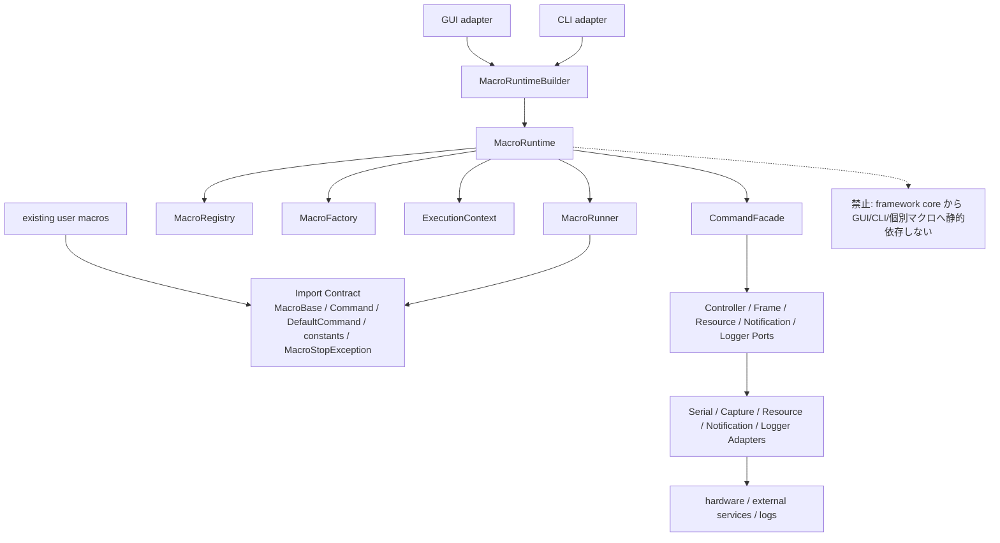

# フレームワーク再設計仕様書

> **対象モジュール**: `src\nyxpy\framework\core\macro\` および将来追加する `src\nyxpy\framework\core\runtime\`
> **目的**: 既存マクロ資産の import 互換を維持しながら、マクロ発見・生成・実行・中断・結果取得を `MacroRuntime` 中心に再整理する。
> **関連ドキュメント**: `.github\skills\framework-spec-writing\template.md`, `spec\framework\archive\architecture.md`, `ARCHITECTURE_DIAGRAMS.md`, `DEPRECATION_AND_MIGRATION.md`, `RESOURCE_FILE_IO.md`, `LOGGING_FRAMEWORK.md`, `RUNTIME_AND_IO_PORTS.md`, `OBSERVABILITY_AND_GUI_CLI.md`
> **既存ソース**: `src\nyxpy\framework\core\macro\base.py`, `src\nyxpy\framework\core\macro\command.py`, `src\nyxpy\framework\core\macro\executor.py`, `src\nyxpy\framework\core\singletons.py`, `src\nyxpy\cli\run_cli.py`, `src\nyxpy\gui\main_window.py`
> **破壊的変更**: なし。特に `nyxpy.framework.core.macro.base.MacroBase` と `nyxpy.framework.core.macro.command.Command` の import は維持する。

## 1. 概要

### 1.1 目的

NyX フレームワークのマクロ実行基盤を、既存マクロが import する `MacroBase` / `Command` / `DefaultCommand` / constants / `MacroStopException` と settings lookup の互換を保ったまま `MacroRuntime` 中心の構成へ段階移行する。`MacroExecutor` は既存 GUI/CLI/テスト移行のための一時 adapter または削除候補であり、既存ユーザーマクロが直接依存していない限り公開互換契約には含めない。

### 1.2 用語定義

| 用語 | 定義 |
|------|------|
| MacroBase | ユーザー定義マクロの抽象基底クラス。現行 import `nyxpy.framework.core.macro.base.MacroBase` と `initialize(cmd, args)` / `run(cmd)` / `finalize(cmd)` のシグネチャを維持する。 |
| Command | マクロがコントローラー操作・画面キャプチャ・画像入出力・ログ・通知・中断を行うための高レベル API。現行 import `nyxpy.framework.core.macro.command.Command` を維持する。 |
| DefaultCommand | 現行 `Command` の標準実装。シリアル通信、キャプチャ、リソース I/O、プロトコル、通知、中断トークンを受け取って実操作を行う。 |
| MacroExecutor | 現行のマクロ発見・選択・実行クラス。再設計後に残す場合は、旧入口から `MacroRuntime` へ委譲するだけの一時 adapter とする。既存ユーザーマクロが直接依存していない限り、実装段階で置換・廃止できる。 |
| MacroRuntime | マクロ発見、実行コンテキスト生成、同期実行、非同期実行、結果取得を統括する新しい実行中核。GUI・CLI が将来参照する主要 API である。 |
| MacroRegistry | `macros` ディレクトリから `MacroBase` 継承クラスを発見し、マクロ定義情報を保持するコンポーネント。マクロの実行インスタンスは保持しない。 |
| MacroDescriptor | `MacroRegistry` 内部で扱う詳細メタデータ。Runtime 公開 API では同じ安定 ID・module/class・表示情報を `MacroDefinition` として受け渡す。 |
| MacroFactory | `MacroRegistry` の定義情報から、実行ごとに新しい `MacroBase` インスタンスを生成するコンポーネント。 |
| MacroRunner | `initialize -> run -> finalize` のライフサイクルを実行し、例外・中断・結果を `RunResult` に変換するコンポーネント。 |
| RunHandle | 非同期実行中のマクロに対する操作ハンドル。中断要求、完了待ち、結果取得、状態確認を提供する。 |
| RunResult | マクロ実行の結果値。`RunStatus(StrEnum)`、`datetime` の開始・終了時刻、`ErrorInfo | None`、`cleanup_warnings` を保持する。 |
| ErrorInfo | 失敗・中断理由を GUI/CLI へ渡すための構造化エラー情報。秘密情報と traceback の表示先を分離する。 |
| ExecutionContext | 1 回のマクロ実行に必要な `run_id`、`macro_name`、Ports、`CancellationToken`、`RuntimeOptions`、`exec_args`、`metadata` をまとめる値オブジェクト。`Command` は保持しない。 |
| RunContext | `MacroRunner` が `RunResult` を組み立てるための実行時刻、run_id、macro_name、token、logger を保持する内部値。 |
| MacroSettingsResolver | `static/<macro_name>/settings.toml` と manifest settings path を解決する専用コンポーネント。画像保存用の `ResourceStorePort` とは分離する。 |
| Ports/Adapters | フレームワーク中核がハードウェア、設定、通知、時刻、スレッド、GUI/CLI に直接依存しないための境界。Port は抽象、Adapter は現行実装への接続である。 |
| Legacy Compatibility Layer | 既存マクロが import する公開面を壊さないための互換層。`MacroExecutor` は既存 GUI/CLI/テスト移行で必要な場合だけここに置き、内部実装は新 runtime に委譲する。 |
| CancellationToken | `Command` の中断判定に使うスレッドセーフな中断メカニズム。現行では `DefaultCommand.stop()` が停止要求後に `MacroStopException` を送出する。 |
| MacroStopException | マクロ中断を表す既存例外。再設計後も既存マクロと既存 GUI/CLI の catch 対象として維持する。 |

### 1.3 背景・問題

#### 現行コードから確認した事実

- `MacroBase` は `description` / `tags` のメタデータと、`initialize(cmd, args)` / `run(cmd)` / `finalize(cmd)` の抽象メソッドを持つ。
- `Command` は `press`、`hold`、`release`、`wait`、`stop`、`log`、`capture`、`save_img`、`load_img`、`keyboard`、`type`、`notify`、`touch`、`disable_sleep` を公開している。
- `DefaultCommand` は `SerialCommInterface`、`CaptureDeviceInterface`、`StaticResourceIO`、`SerialProtocolInterface`、`CancellationToken`、`NotificationHandler` を受け取り、マクロ用操作を実行する。
- `MacroExecutor` は `Path.cwd() / "macros"` を探索し、`MacroBase` 継承クラスを import してインスタンス化し、`self.macros` に保持する。
- `MacroExecutor.execute()` は `load_macro_settings()` の結果と実行引数をマージし、`initialize -> run -> finalize` を呼ぶ。例外発生時も `finalize()` は呼ばれる。
- `singletons.py` は `serial_manager`、`capture_manager`、`global_settings`、`secrets_settings` をグローバルに生成し、`initialize_managers()` と `reset_for_testing()` を提供する。
- CLI と GUI はそれぞれ `DefaultCommand` を組み立て、`MacroExecutor` へ渡して実行する。GUI は `QThread` の `WorkerThread` で実行し、中断時は `cmd.stop()` を呼ぶ。

#### 問題

- マクロ発見、実行インスタンス生成、ライフサイクル実行、GUI/CLI の実行制御が `MacroExecutor`、CLI、GUI、`DefaultCommand` に分散している。
- 現行 `MacroExecutor` は発見時にマクロをインスタンス化するため、マクロが内部状態を持つ場合に実行間状態が残りやすい。
- GUI と CLI が `DefaultCommand` の構築手順をそれぞれ持つため、デバイス、プロトコル、通知、中断トークンの組み合わせ方が重複している。
- `singletons.py` のグローバル状態に GUI/CLI/Command が強く依存しており、実機なしの単体テストと並列テストを組みにくい。
- 既存マクロ資産は import パスに強く依存しているため、再設計で最初に守るべき制約は設計の純粋性ではなく import 互換である。

### 1.4 期待効果

| 指標 | 現状 | 目標 |
|------|------|------|
| 既存 import 破壊件数 | 変更次第で発生しうる | `MacroBase` / `Command` / `DefaultCommand` / constants / `MacroStopException` は 0 件 |
| マクロ実行ごとのインスタンス分離 | `MacroExecutor.reload_macros()` 時に生成したインスタンスを再利用 | `MacroFactory` が実行ごとに新規生成 |
| GUI/CLI の `DefaultCommand` 構築箇所 | CLI と GUI に重複 | `ExecutionContext` 生成 adapter に集約 |
| 実機不要の実行基盤単体テスト | `MacroExecutor` と singleton 依存の影響を受ける | Dummy Port / Adapter で `MacroRegistry`、`MacroFactory`、`MacroRunner`、`MacroRuntime` を検証 |
| 非同期実行の結果表現 | GUI の `finished` 文字列に依存 | `RunHandle` と `RunResult` で成功・中断・失敗を表現 |
| 段階移行時の GUI/CLI 変更量 | 実行構築と画面制御が混在 | 既存 import を残した adapter 置換に限定 |

### 1.5 着手条件

- 現行コードを正とし、`spec\framework\archive\architecture.md` は参考資料として扱う。
- 既存マクロが使う `nyxpy.framework.core.macro.base.MacroBase` と `nyxpy.framework.core.macro.command.Command` の import を維持する。
- `nyxpy.framework.core.macro.command.DefaultCommand`、constants、`MacroStopException`、既存 settings lookup も互換対象として扱う。
- 新 runtime を導入する前に、既存 import 互換テストを追加する。
- 実装着手時は `uv run pytest tests\unit\` が既存ベースラインとして通ることを確認する。
- GUI/CLI の置換は `MacroRuntime` の同期実行・非同期実行・中断・結果取得が単体テストで固定された後に行う。

## 2. 対象ファイル

現時点の作業対象は本仕様書のみである。以下の表は、本仕様が想定する段階移行の実装対象を含む。

| ファイル | 変更種別 | 変更内容 |
|----------|----------|----------|
| `spec\framework\rearchitecture\FW_REARCHITECTURE_OVERVIEW.md` | 新規 | フレームワーク再設計方針、互換方針、実装仕様、テスト方針を定義する。 |
| `src\nyxpy\framework\core\runtime\__init__.py` | 新規 | `MacroRuntime`、`MacroRunner`、`RunHandle`、`RunResult`、`ExecutionContext` を公開する。 |
| `src\nyxpy\framework\core\runtime\context.py` | 新規 | `ExecutionContext`, `RunContext`, `RuntimeOptions` を定義する。`ExecutionContext` は `Command` を持たない。 |
| `src\nyxpy\framework\core\runtime\result.py` | 新規 | `RunStatus`, `ErrorInfo`, `RunResult` を定義する。 |
| `src\nyxpy\framework\core\runtime\handle.py` | 新規 | `RunHandle` とスレッド実装を定義する。 |
| `src\nyxpy\framework\core\runtime\runner.py` | 新規 | `MacroBase` と `Command` を受け、ライフサイクル実行と `RunResult` 生成だけを担当する。 |
| `src\nyxpy\framework\core\runtime\runtime.py` | 新規 | registry 解決、factory 呼び出し、Ports 準備、`CommandFacade` 生成、Port close を担当する。 |
| `src\nyxpy\framework\core\macro\registry.py` | 新規 | `MacroRegistry`, `MacroDescriptor`, `MacroFactory`, `MacroManifest` を定義する正配置。 |
| `src\nyxpy\framework\core\macro\settings_resolver.py` | 新規 | `MacroSettingsResolver` を定義し、設定 TOML 解決を画像リソース I/O から分離する。 |
| `src\nyxpy\framework\core\macro\base.py` | 変更 | import パスと `MacroBase` シグネチャを維持する。初期段階では定義を移動しない。移動する場合も re-export と互換テストを先に置く。 |
| `src\nyxpy\framework\core\macro\command.py` | 変更 | `Command` / `DefaultCommand` の import パスと公開メソッドを維持する。内部依存だけを Ports/Adapters に寄せる。 |
| `src\nyxpy\framework\core\macro\executor.py` | 変更または削除 | `MacroExecutor` を残す場合は旧入口から `MacroRuntime` へ委譲するだけの一時 adapter とする。GUI/CLI を直接 Runtime へ移行できるなら削除候補にする。 |
| `src\nyxpy\framework\core\singletons.py` | 変更 | 既存 singleton を維持しつつ、runtime adapter が参照する既定依存の生成・リセット点を整理する。 |
| `src\nyxpy\cli\run_cli.py` | 変更 | 将来的に `MacroRuntime` を使う CLI adapter へ移行する。既存 `create_command()`、`execute_macro()` は互換関数として残す。 |
| `src\nyxpy\gui\main_window.py` | 変更 | 将来的に `MacroRuntime.start()` と `RunHandle` を使う GUI adapter へ移行する。既存 import は段階移行中も残す。 |
| `tests\unit\framework\macro\test_legacy_imports.py` | 新規 | `MacroBase`、`Command`、`DefaultCommand`、constants、`MacroStopException` の import 互換と主要シグネチャを検証する。 |
| `tests\unit\framework\runtime\test_macro_registry.py` | 新規 | マクロ探索、reload、パッケージ型マクロ、import キャッシュ削除を検証する。 |
| `tests\unit\framework\runtime\test_macro_factory.py` | 新規 | 実行ごとに新規 `MacroBase` インスタンスが生成されることを検証する。 |
| `tests\unit\framework\runtime\test_macro_runner.py` | 新規 | 正常終了、中断、例外、`finalize()` 呼び出し保証、`RunResult` を検証する。 |
| `tests\unit\framework\runtime\test_execution_context.py` | 新規 | `ExecutionContext` と adapter が `Command`、設定、通知、中断トークンを正しく束ねることを検証する。 |
| `tests\integration\test_macro_runtime_legacy_executor.py` | 新規 | `MacroExecutor` を残す場合、旧入口から `MacroRuntime` へ委譲され、ライフサイクルを二重実装しないことを検証する。 |
| `tests\integration\test_cli_runtime_adapter.py` | 新規 | CLI adapter が既存引数から `ExecutionContext` を作り、runtime 実行へ接続できることを検証する。 |
| `tests\gui\test_main_window_runtime_adapter.py` | 新規 | GUI adapter が `RunHandle` の完了・中断・失敗を既存 UI 状態へ反映することを検証する。 |
| `tests\hardware\test_macro_runtime_realdevice.py` | 新規 | 実機接続時の runtime 実行、シリアル送信、キャプチャ取得を `@pytest.mark.realdevice` で検証する。 |
| `tests\perf\test_macro_discovery_perf.py` | 新規 | マクロ探索と reload が既存規模で許容時間内に収まることを検証する。 |

## 3. 設計方針

### 3.1 アーキテクチャ上の位置づけ

#### 提案する構成

```text
nyxpy.cli / nyxpy.gui
  -> CLI Adapter / GUI Adapter
    -> MacroRuntime
      -> MacroRegistry (`core.macro.registry`)
      -> MacroFactory
      -> Ports 準備 / CommandFacade 生成
      -> MacroRunner
        -> MacroBase
        -> Command
          -> Ports
            -> Adapters
              -> SerialManager / CaptureManager / ProtocolFactory / StaticResourceIO / NotificationHandler / LogManager

Legacy Compatibility Layer
  -> nyxpy.framework.core.macro.base.MacroBase
  -> nyxpy.framework.core.macro.command.Command
  -> nyxpy.framework.core.macro.command.DefaultCommand
  -> nyxpy.framework.core.macro.executor.MacroExecutor  # 残す場合のみ
```

詳細な図は [ARCHITECTURE_DIAGRAMS.md](ARCHITECTURE_DIAGRAMS.md) を参照する。最重要の依存方向は、GUI/CLI と既存マクロが上位利用者であり、Runtime 中核が Ports/Adapters を介してハードウェア/外部 I/O へ到達することである。



`MacroRuntime` はマクロ実行の組み立て点である。registry 解決、factory 呼び出し、Ports 準備、`CommandFacade(context)` 生成、Port close だけを担当し、`initialize -> run -> finalize` と `RunResult` 生成は `MacroRunner` へ委譲する。GUI と CLI は実行中核ではなく、入力値の受け取り、進捗表示、終了表示、設定反映を担当する adapter である。フレームワーク層は GUI へ依存せず、GUI は `RunHandle` と `RunResult` を Qt の signal に変換する。

### 3.2 公開 API 方針

#### 維持する import と移行対象

| import | 方針 |
|--------|------|
| `from nyxpy.framework.core.macro.base import MacroBase` | 必ず維持する。シグネチャも維持する。 |
| `from nyxpy.framework.core.macro.command import Command` | 必ず維持する。既存マクロが呼ぶ公開メソッドを削除しない。 |
| `from nyxpy.framework.core.macro.command import DefaultCommand` | 維持する。CLI/GUI と既存テストの移行を妨げない。 |
| `from nyxpy.framework.core.macro.executor import MacroExecutor` | 既存ユーザーマクロが直接依存していない限り公開互換契約から外す。既存 GUI/CLI/テスト移行のために残す場合は、`reload_macros()` / `set_active_macro()` / `execute()` から `MacroRuntime` へ委譲するだけの薄い adapter とする。 |
| `from nyxpy.framework.core.macro.exceptions import MacroStopException` | 維持する。中断の catch 対象を変えない。 |

#### 新規 API

正 API は本 Overview の 4.1.2 に集約する。詳細な Port とエラー仕様は `RUNTIME_AND_IO_PORTS.md` と `ERROR_CANCELLATION_LOGGING.md` を正とする。Resource File I/O の配置・path guard・atomic write は `RESOURCE_FILE_IO.md`、sink・backend・ログ保持・GUI 表示イベントは `LOGGING_FRAMEWORK.md` を正とする。新規コードは `nyxpy.framework.core.runtime` を優先して参照するが、`MacroRegistry` の正配置は `src\nyxpy\framework\core\macro\registry.py` である。既存マクロは変更不要であり、マクロ作者に `MacroRuntime` 利用を強制しない。

#### 互換ポリシー

| 区分 | 対象 | 方針 |
|------|------|------|
| 永久維持 | `MacroBase` / `Command` / `DefaultCommand` import path、constants import、`MacroBase.initialize(cmd, args)` / `run(cmd)` / `finalize(cmd)`、`Command` 公開メソッド、`MacroStopException()` / `MacroStopException("stop")`、`static/<macro_name>/settings.toml` lookup | 既存マクロ変更不要の前提で維持する。 |
| 一時 adapter / 廃止候補 | `MacroExecutor`, legacy loader, `cwd` fallback | 既存 GUI/CLI/テスト移行に必要な場合だけ残す。残す場合の責務は Runtime / Ports / Registry への委譲に限定し、既存ユーザーマクロが直接依存していないなら廃止できる。 |
| 非推奨後削除候補 | 暗黙 dummy fallback、恒久的な `sys.path` 変更、`cwd` 起点だけに依存する探索、settings path の曖昧解決 | 非推奨警告と移行期間を置き、削除可否は別仕様で判断する。 |

廃止候補の削除条件、代替 API、互換影響、テストゲート、移行順は `DEPRECATION_AND_MIGRATION.md` を正とする。`MacroBase`、`Command`、`DefaultCommand`、constants、`MacroStopException`、`static\<macro_name>\settings.toml` lookup は廃止候補に含めない。

### 3.3 後方互換性

#### 段階移行

| 段階 | 内容 | 互換性の扱い |
|------|------|--------------|
| Phase 0 | import/signature 互換テストを追加する。 | 実装変更前に `MacroBase` / `Command` / `DefaultCommand` / constants / `MacroStopException` / settings lookup の契約を固定する。 |
| Phase 1 | `core.macro.registry` の `MacroRegistry` / `MacroFactory` / `MacroSettingsResolver` を導入する。 | `MacroExecutor` を残す場合も旧ロード互換だけを担わせ、ライフサイクル実行は Runtime / Runner へ寄せる。 |
| Phase 2 | `MacroRunner` を導入し、`initialize -> run -> finalize`、`RunResult`、`MacroStopException` 正規化を固定する。 | `MacroBase.finalize(cmd)` を唯一の抽象契約として維持し、outcome は opt-in にする。 |
| Phase 3 | `RunResult` / cancellation / finalize outcome opt-in を GUI/CLI へ渡せる形にする。 | 旧 `execute()` は `None` 戻り値と例外再送出を維持する。 |
| Phase 4 | 必要な場合だけ `MacroExecutor` を Runtime 委譲へ変更する。 | 旧入口を残す場合は薄い adapter とし、不要なら GUI/CLI を Runtime へ直接移行して削除する。 |
| Phase 5 | Ports / `CommandFacade` を導入し、`DefaultCommand` 内部を移行する。 | `Command.type(key: str | KeyCode | SpecialKeyCode)` を含む既存呼び出しを維持する。 |
| Phase 6 | CLI を Runtime adapter へ移行する。 | 通知設定ソースは `SecretsSettings` に統一し、終了コードは `RunResult` から決める。 |
| Phase 7 | GUI を Runtime adapter へ移行する。 | `RunHandle` と GUI log event を Qt 層で変換し、core 層に Qt 依存を入れない。 |

非推奨化が必要になった場合でも即削除しない。`warnings.warn(..., DeprecationWarning, stacklevel=2)` を使い、削除時期は別仕様で決める。

### 3.4 レイヤー構成

#### 依存方向

```text
macros\{macro_name}\  -> nyxpy.framework.core.macro.*   許可
macros\{macro_name}\  -> nyxpy.framework.core.runtime.* 任意。既存マクロには要求しない
nyxpy.gui             -> nyxpy.framework.*              許可
nyxpy.cli             -> nyxpy.framework.*              許可
nyxpy.framework.*     -> nyxpy.gui                      禁止
nyxpy.framework.*     -> nyxpy.cli                      禁止
nyxpy.framework.*     -> macros\{macro_name}\           禁止。ただし importlib によるユーザーマクロ探索は runtime registry の責務として許可
```

`MacroRuntime` は GUI/CLI に依存しない。Qt 固有の `QThread` や signal は GUI adapter に閉じ込める。CLI の `argparse.Namespace` も runtime へ渡さず、adapter で `ExecutionContext` と `RuntimeConfig` に変換する。

### 3.5 Ports/Adapters 方針

#### 事実

現行 `DefaultCommand` はシリアル通信、キャプチャ、リソース I/O、プロトコル、通知、ログ、中断を直接保持する。この構成は単純だが、CLI/GUI で構築手順が重複しやすい。

#### 提案

`Command` の公開 API は維持し、構築時の依存だけを Ports/Adapters に寄せる。Resource File I/O の詳細は `RESOURCE_FILE_IO.md`、ロギング基盤の詳細は `LOGGING_FRAMEWORK.md` に分け、本 Overview では接続境界だけを扱う。最初の実装では既存 `SerialCommInterface`、`CaptureDeviceInterface`、`SerialProtocolInterface`、`StaticResourceIO`、`NotificationHandler` を Port として扱い、新しい抽象を増やしすぎない。追加抽象が必要な境界は `SettingsPort`、`ClockPort`、`RuntimeThreadPort` に限定する。

### 3.6 性能要件

| 指標 | 目標値 |
|------|--------|
| import 互換テスト | `uv run pytest tests\unit\framework\macro\test_legacy_imports.py` が 1 秒以内 |
| マクロ reload | 既存 `macros` ディレクトリ規模で 2 秒以内 |
| 実行ごとの factory 生成 | 1 マクロあたり 10 ms 未満を目安とする |
| `Command.press()` など既存操作 | runtime 導入前後で追加待機時間を発生させない |
| GUI 中断反映 | 中断要求から UI 状態更新まで 500 ms 未満を目標とする |

性能要件は CI と開発 PC で差が出るため、初回は測定値を記録し、しきい値は実測後に調整する。

### 3.7 並行性・スレッド安全性

`MacroRunner.start()` は core 層では標準ライブラリのスレッド実行を基本とし、Qt へ依存しない。GUI は `RunHandle` を直接 UI スレッドから待たず、Qt adapter で完了通知へ変換する。中断は `CancellationToken` を経由し、既存 `cmd.stop()` の挙動を保つ。

`MacroRegistry.reload()` は import キャッシュを更新するため、同時実行中の reload と run を許可しない。`MacroRuntime` は registry 更新と実行開始の境界にロックを置く。すでに開始したマクロは、開始時点の `MacroDefinition` と factory 生成済みインスタンスで完結させる。

### 3.8 未決事項

| 項目 | 未決内容 | 判断基準 |
|------|----------|----------|
| 非同期実行の実装単位 | core 層の `RunHandle` が `threading.Thread` を直接持つか、実行器 Port を必須にするか。 | GUI から Qt 依存を排除でき、単体テストで制御しやすい方を採用する。 |
| `MacroDefinition` の class 参照保持 | import 後の class object を保持するか、module/class 名だけ保持して factory で再解決するか。 | reload 時の古い参照混入を防げることを優先する。 |
| `DefaultCommand.stop()` の例外送出 | 停止要求だけにするか、現行どおり `MacroStopException` を送出するか。 | 互換性優先のため初期段階では現行挙動を維持する。 |
| singleton の runtime 登録 | `singletons.py` に既定 runtime を置くか、factory 関数に留めるか。 | テスト間状態汚染が少ない方を採用する。 |

## 4. 実装仕様

### 4.1 公開インターフェース

#### 4.1.1 既存マクロ互換 API と移行 adapter

```python
from abc import ABC, abstractmethod
from pathlib import Path
from typing import Any

import cv2


class MacroBase(ABC):
    description: str = ""
    tags: list[str] = []

    @abstractmethod
    def initialize(self, cmd: "Command", args: dict) -> None:
        ...

    @abstractmethod
    def run(self, cmd: "Command") -> None:
        ...

    @abstractmethod
    def finalize(self, cmd: "Command") -> None:
        ...


class Command(ABC):
    @abstractmethod
    def press(self, *keys: Any, dur: float = 0.1, wait: float = 0.1) -> None:
        ...

    @abstractmethod
    def hold(self, *keys: Any) -> None:
        ...

    @abstractmethod
    def release(self, *keys: Any) -> None:
        ...

    @abstractmethod
    def wait(self, wait: float) -> None:
        ...

    @abstractmethod
    def stop(self) -> None:
        ...

    @abstractmethod
    def log(self, *values: Any, sep: str = " ", end: str = "\n", level: str = "DEBUG") -> None:
        ...

    @abstractmethod
    def capture(
        self,
        crop_region: tuple[int, int, int, int] | None = None,
        grayscale: bool = False,
    ) -> cv2.typing.MatLike:
        ...

    @abstractmethod
    def save_img(self, filename: str | Path, image: cv2.typing.MatLike) -> None:
        ...

    @abstractmethod
    def load_img(self, filename: str | Path, grayscale: bool = False) -> cv2.typing.MatLike:
        ...

    @abstractmethod
    def keyboard(self, text: str) -> None:
        ...

    @abstractmethod
    def type(self, key: Any) -> None:
        ...

    @abstractmethod
    def notify(self, text: str, img: cv2.typing.MatLike | None = None) -> None:
        ...

    def touch(self, x: int, y: int, dur: float = 0.1, wait: float = 0.1) -> None:
        raise NotImplementedError("Current serial protocol does not support touch input.")

    def touch_down(self, x: int, y: int) -> None:
        raise NotImplementedError("Current serial protocol does not support touch input.")

    def touch_up(self) -> None:
        raise NotImplementedError("Current serial protocol does not support touch input.")

    def disable_sleep(self, enabled: bool = True) -> None:
        raise NotImplementedError("Current serial protocol does not support sleep control.")


# MacroExecutor は既存マクロ互換 API ではない。
# 残す場合だけ旧 GUI/CLI/テスト入口から Runtime へ委譲する一時 adapter とする。
class MacroExecutor:
    macros: dict[str, MacroBase]
    macro: MacroBase | None

    def reload_macros(self) -> None:
        ...

    def set_active_macro(self, macro_name: str) -> None:
        ...

    def execute(self, cmd: Command, exec_args: dict = {}) -> None:
        ...
```

`MacroExecutor` は公開互換契約ではない。既存 GUI/CLI/テスト移行のために残す場合だけ上記シグネチャを保ち、内部実装では即座に `dict(exec_args)` を作成して可変デフォルト値の副作用を避ける。

#### 4.1.2 新 runtime API

```python
from collections.abc import Mapping, Sequence
from dataclasses import dataclass, field
from datetime import datetime
from enum import StrEnum
from pathlib import Path
from typing import Any

from nyxpy.framework.core.macro.base import MacroBase
from nyxpy.framework.core.macro.command import Command
from nyxpy.framework.core.utils.cancellation import CancellationToken


class RunStatus(StrEnum):
    SUCCESS = "success"
    CANCELLED = "cancelled"
    FAILED = "failed"


@dataclass(frozen=True)
class ErrorInfo:
    kind: str
    code: str
    message: str
    component: str
    exception_type: str
    recoverable: bool = False
    details: Mapping[str, Any] = field(default_factory=dict)
    traceback: str | None = None


@dataclass(frozen=True)
class MacroDefinition:
    id: str
    module_name: str
    class_name: str
    display_name: str
    description: str = ""
    tags: tuple[str, ...] = ()


@dataclass(frozen=True)
class RuntimeOptions:
    allow_dummy: bool = False
    frame_ready_timeout_sec: float = 3.0
    release_timeout_sec: float = 2.0
    wait_poll_interval_sec: float = 0.05


@dataclass(frozen=True)
class ExecutionContext:
    run_id: str
    macro_name: str
    controller: object
    frame_source: object
    resources: object
    notifications: object
    logger: object
    cancellation_token: CancellationToken
    options: RuntimeOptions = field(default_factory=RuntimeOptions)
    exec_args: Mapping[str, Any] = field(default_factory=dict)
    metadata: Mapping[str, Any] = field(default_factory=dict)


@dataclass(frozen=True)
class RunContext:
    run_id: str
    macro_name: str
    started_at: datetime
    cancellation_token: CancellationToken
    logger: object


@dataclass(frozen=True)
class RunResult:
    run_id: str
    macro_name: str
    status: RunStatus
    started_at: datetime
    finished_at: datetime
    error: ErrorInfo | None = None
    cleanup_warnings: tuple[str, ...] = ()

    @property
    def duration_sec(self) -> float: ...


class MacroRegistry:
    def reload(self) -> None: ...
    def list(self) -> Mapping[str, MacroDefinition]: ...
    def get(self, macro_name: str) -> MacroDefinition: ...


class MacroFactory:
    def create(self, definition: MacroDefinition) -> MacroBase: ...


class MacroRunner:
    def run(
        self,
        macro: MacroBase,
        cmd: Command,
        exec_args: Mapping[str, Any],
        run_context: RunContext,
    ) -> RunResult: ...


class RunHandle:
    def cancel(self) -> None: ...
    def wait(self, timeout: float | None = None) -> bool: ...
    def done(self) -> bool: ...
    def result(self) -> RunResult: ...


class MacroRuntime:
    def reload(self) -> None: ...
    def list_macros(self) -> Mapping[str, MacroDefinition]: ...
    def create_context(
        self,
        *,
        macro_name: str,
        exec_args: Mapping[str, Any] | None = None,
        metadata: Mapping[str, Any] | None = None,
        cancellation_token: CancellationToken | None = None,
    ) -> ExecutionContext: ...
    def run(self, context: ExecutionContext) -> RunResult: ...
    def start(self, context: ExecutionContext) -> RunHandle: ...
```

`ExecutionContext` は `Command` を保持しない。`MacroRuntime.create_context()` は `exec_args` と `metadata` を `dict(...)` で shallow copy し、実行中は `Mapping[str, Any]` として扱う。`MacroRuntime.run()` は `CommandFacade(context)` を生成し、`MacroRunner.run(macro, cmd, context.exec_args, run_context)` へ渡す。`RunResult` は `datetime` と `RunStatus(StrEnum)` を使い、失敗情報は `ErrorInfo | None`、解放失敗は `cleanup_warnings` に集約する。

### 4.2 内部設計

#### 4.2.1 マクロ発見

1. `MacroRuntime.reload()` が `MacroRegistry.reload()` を呼ぶ。
2. `MacroRegistry` は `macros_dir` を走査する。既定値は `Path.cwd() / "macros"` で現行挙動を維持する。
3. 単一ファイル型 `macros\sample.py` とパッケージ型 `macros\sample\__init__.py` を対象にする。
4. 現行 `MacroExecutor` と同様に、対象 module とそのサブモジュールを `sys.modules` から削除してから import する。
5. `inspect.getmembers(module, inspect.isclass)` で `MacroBase` 継承クラスを見つける。
6. `MacroDefinition` には class 名、module 名、表示名、`description`、`tags` を保存する。
7. 発見時にマクロインスタンスは生成しない。

#### 4.2.2 マクロ生成

1. `MacroRuntime.run(context)` または `MacroRuntime.start(context)` が `MacroRegistry.get(context.macro_name)` を呼ぶ。
2. `MacroFactory.create(definition)` が module/class を解決し、新しい `MacroBase` インスタンスを生成する。
3. 生成失敗は `MacroLoadError` として扱い、Legacy adapter では現行の `ValueError` または既存ログ出力に変換する。

#### 4.2.3 同期実行

```text
MacroRuntime.run(context)
  -> descriptor = MacroRegistry.get(context.macro_name)
  -> macro = MacroFactory.create(descriptor)
  -> Ports の readiness を確認
  -> cmd = CommandFacade(context)
  -> run_context = RunContext(...)
  -> result = MacroRunner.run(macro, cmd, context.exec_args, run_context)
  -> controller/frame_source/resources close を試行
  -> close 失敗だけ result.cleanup_warnings に追記
  -> RunResult
```

`MacroRunner` は `initialize -> run -> finalize`、outcome 判定、`MacroStopException` の `RunStatus.CANCELLED` への正規化、`RunResult` 生成を担当する。`MacroRuntime` は Runner の結果を上書きしない。Runtime が追加できるのは Port close 失敗に由来する `cleanup_warnings` だけである。

`finalize()` は成功・中断・失敗のすべてで 1 回だけ呼ぶ。`MacroBase.finalize(cmd)` を唯一の抽象契約として維持し、outcome 受け取りは `SupportsFinalizeOutcome` などの opt-in 拡張契約に限定する。

#### 4.2.4 非同期実行

```text
MacroRuntime.start(context)
  -> worker thread で MacroRuntime.run(context)
  -> RunHandle

GUI Adapter
  -> handle.cancel()
  -> handle.wait(timeout) -> bool
  -> handle.done() -> bool
  -> handle.result() -> RunResult
  -> RunResult を Qt Signal に変換
```

`RunHandle.cancel()` は `ExecutionContext.cancellation_token.request_stop()` または `request_cancel()` を呼ぶ。新 GUI adapter は UI スレッドから `cmd.stop()` を呼ばず、`RunHandle.cancel()` を優先する。`result()` は未完了時に `RuntimeError` を送出してよい。

#### 4.2.5 Legacy Compatibility Layer

`MacroExecutor` を残す場合、以下の互換だけを維持する薄い adapter である。残さず GUI/CLI を `MacroRuntime` へ直接移行する選択も許容する。

- `reload_macros()` は `MacroRuntime.reload()` / `MacroRegistry.reload()` へ委譲し、`macros` 互換 facade を更新する。
- `set_active_macro(macro_name)` は Runtime/Registry の解決結果を保持し、見つからない場合に現行どおり `ValueError` を送出する。
- `execute(cmd, exec_args)` は `RunResult` を返さず `None` を維持する。内部 `RunResult` が失敗の場合は現行どおり例外を再送出する。
- ライフサイクル実行、`RunResult` 生成、`MacroStopException` 正規化を `MacroExecutor` に二重実装しない。

### 4.3 設定パラメータ

| パラメータ | 型 | デフォルト | 説明 |
|------------|-----|-----------|------|
| `macros_dir` | `Path` | `Path.cwd() / "macros"` | マクロ探索ディレクトリ。現行 `MacroExecutor` と同じ既定値にする。 |
| `resources_dir` | `Path` | `Path.cwd() / "static"` | 画像保存・読み込み用 `ResourceStorePort` の root。settings TOML 解決には使わない。 |
| `macro_settings_root` | `Path` | `project_root` | `MacroSettingsResolver` が `static/<macro_name>/settings.toml` 互換と manifest settings path を解決する起点。 |
| `compatibility_mode` | `bool` | `True` | Legacy adapter の挙動を優先するかを示す。初期段階では常に `True` とする。 |
| `auto_register_devices` | `bool` | `True` | 既定 adapter が `SerialManager` / `CaptureManager` の auto register を行うか。 |
| `protocol_name` | `str` | `"CH552"` | GUI/CLI adapter が `ProtocolFactory` に渡すプロトコル名。CLI では引数値を優先する。 |
| `execution_timeout_sec` | `float | None` | `None` | 非同期実行の結果待ちに使う任意の timeout。runtime 自体は timeout を強制しない。 |

### 4.4 エラーハンドリング

| 例外クラス | 発生条件 | Legacy adapter での扱い |
|------------|----------|--------------------------|
| `MacroNotFoundError` | 指定名のマクロ定義が registry に存在しない。 | `ValueError` に変換し、現行メッセージ形式に合わせる。 |
| `MacroLoadError` | import、class 解決、インスタンス生成に失敗した。 | `log_manager.log("ERROR", ...)` へ記録し、必要に応じて `ValueError` または元例外を再送出する。 |
| `MacroExecutionError` | `initialize()`、`run()`、`finalize()` のいずれかで予期しない例外が発生した。 | 現行どおり `cmd.log()` 後に元例外を再送出する。 |
| `MacroStopException` | 既存 `cmd.stop()` または `check_interrupt` による中断。 | 中断結果 `RunStatus.CANCELLED` に変換し、Legacy adapter では既存の中断ログに合わせる。 |
| `TimeoutError` | `RunHandle.result(timeout=...)` の待機時間を超えた。 | GUI/CLI adapter 側で表示・終了コードへ変換する。 |

新規例外は runtime 内部で使う。既存マクロに新規例外の catch を要求しない。

### 4.5 シングルトン管理

現行 `singletons.py` の `serial_manager`、`capture_manager`、`global_settings`、`secrets_settings` は削除しない。初期段階では `DefaultRuntimeAdapters` がこれらを参照し、CLI/GUI の構築重複を減らす。

`MacroRuntime` 自体をグローバル singleton にするかは未決である。テスト容易性を優先し、まずは `create_default_runtime()` のような factory 関数で既定依存を組み立てる方針とする。`reset_for_testing()` は既存 singleton の再生成に加え、将来 runtime 既定依存を保持する場合はそれも破棄する。

## 5. テスト方針

| テスト種別 | テスト名 | 検証内容 |
|------------|----------|----------|
| ユニット | `test_legacy_imports_keep_macro_base_command_default_constants` | `MacroBase`、`Command`、`DefaultCommand`、constants、`MacroStopException` が既存 import パスから import でき、主要メソッドのシグネチャが変わっていないことを検証する。 |
| ユニット | `test_registry_discovers_file_and_package_macros` | 単一ファイル型とパッケージ型の `MacroBase` 継承クラスを `MacroRegistry` が発見できることを検証する。 |
| ユニット | `test_registry_reload_removes_stale_submodules` | reload 時に対象 module とサブモジュールの古い `sys.modules` エントリが削除され、変更が反映されることを検証する。 |
| ユニット | `test_factory_creates_new_instance_per_run` | `MacroFactory.create()` が呼び出しごとに別インスタンスを返し、実行間状態を共有しないことを検証する。 |
| ユニット | `test_runner_calls_lifecycle_in_order` | `initialize -> run -> finalize` の順序と引数マージを検証する。 |
| ユニット | `test_runner_calls_finalize_on_error` | `run()` が例外を送出しても `finalize()` が 1 回呼ばれ、`RunResult.status` が `FAILED` になることを検証する。 |
| ユニット | `test_runner_converts_macro_stop_to_cancelled` | `MacroStopException` を `RunStatus.CANCELLED` として扱うことを検証する。 |
| ユニット | `test_execution_context_shallow_copies_args_and_metadata` | `exec_args` と `metadata` を shallow copy し、`Command` を保持しないことを検証する。 |
| ユニット | `test_run_handle_wait_done_result_contract` | `wait(timeout) -> bool`、`done() -> bool`、`result() -> RunResult` の契約を検証する。 |
| ユニット | `test_command_type_accepts_str_keycode_special_keycode` | `Command.type(key: str | KeyCode | SpecialKeyCode)` の互換を検証する。 |
| ユニット | `test_run_handle_cancel_requests_token` | `RunHandle.cancel()` が `CancellationToken` に停止要求を出し、実行中マクロが中断できることを検証する。 |
| ユニット | `test_execution_context_builds_default_command_from_adapters` | adapter が既定 manager、protocol、resource、notification、token から `DefaultCommand` を構築できることを検証する。 |
| 結合 | `test_macro_executor_delegates_to_runtime_if_kept` | `MacroExecutor` を残す場合、`reload_macros()`、`set_active_macro()`、`execute()` が runtime へ委譲され、ライフサイクルを二重実装しないことを検証する。 |
| 結合 | `test_cli_adapter_runs_macro_with_define_args` | CLI 引数から実行引数を作り、runtime 経由でマクロを実行できることを検証する。 |
| GUI | `test_main_window_runtime_adapter_updates_running_state` | GUI adapter が実行開始、完了、中断、失敗を `ControlPane` と status label に反映することを検証する。 |
| ハードウェア | `test_macro_runtime_realdevice_press_and_capture` | 実機接続時に `DefaultCommand` 経由の press と capture が runtime 実行でも動作することを `@pytest.mark.realdevice` で検証する。 |
| パフォーマンス | `test_macro_registry_reload_perf` | 既存 `macros` 規模で registry reload が目標時間内に収まることを検証する。 |

テスト用マクロは一時ディレクトリではなく、pytest の `tmp_path` 相当を使う場合でもリポジトリ外への固定パス書き込みを避ける。実装時は既存テスト配置規約に合わせ、純粋ロジックは `tests\unit\`、複数モジュール連携は `tests\integration\`、Qt 連携は `tests\gui\`、実機必須は `tests\hardware\`、性能測定は `tests\perf\` に置く。

## 6. 実装チェックリスト

- [x] 現行 `MacroBase` の import パスと抽象メソッドを確認
- [x] 現行 `Command` / `DefaultCommand` の import パスと公開メソッドを確認
- [x] 現行 `MacroExecutor` の探索・選択・実行フローを確認
- [x] 現行 `singletons.py` の manager/settings 管理を確認
- [x] 現行 CLI の `DefaultCommand` 構築と `MacroExecutor` 実行を確認
- [x] 現行 GUI の `WorkerThread`、中断、完了通知を確認
- [x] import 互換維持を最優先制約として明記
- [x] `MacroRuntime`、`MacroRegistry`、`MacroFactory`、`MacroRunner`、`RunHandle`、`RunResult`、`ExecutionContext` の責務を定義
- [x] Ports/Adapters と Legacy Compatibility Layer の方針を定義
- [x] GUI/CLI を将来的に `MacroRuntime` adapter へ寄せる方針を定義
- [x] 段階移行の Phase を定義
- [x] 対象ファイル表を作成
- [x] 実装仕様の公開インターフェースを記載
- [x] エラーハンドリング方針を記載
- [x] シングルトン管理方針を記載
- [x] テスト方針をテスト種別別に記載
- [ ] Phase 1 実装前に import 互換テストを追加
- [ ] `MacroRuntime` 系クラスを実装
- [ ] `MacroExecutor` を残す場合は runtime 委譲へ移行し、不要なら削除
- [ ] CLI adapter を runtime 経由へ移行
- [ ] GUI adapter を runtime 経由へ移行
- [ ] 既存マクロを変更せずに主要テストが通ることを確認
