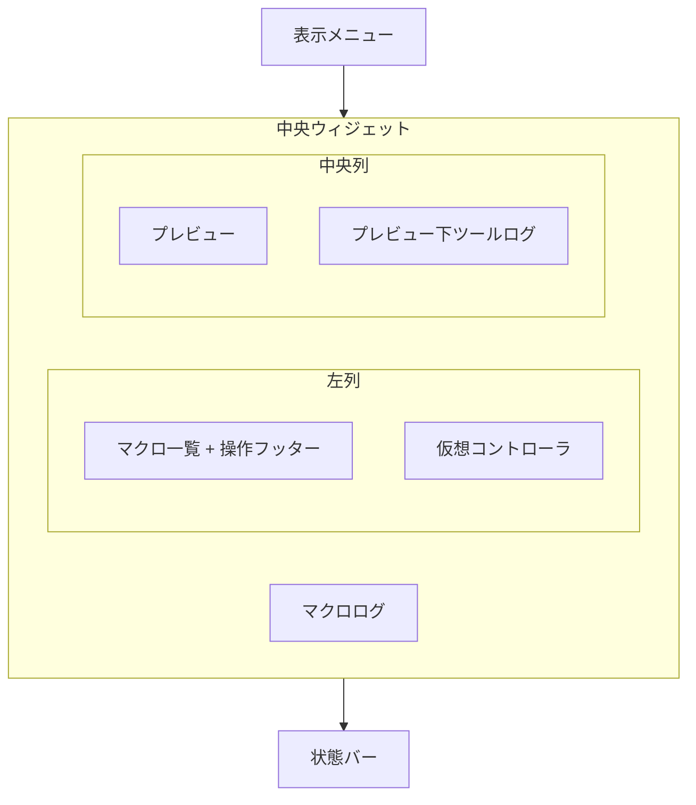

# GUI 外観再設計: ウィンドウサイズ規定とパネル配置仕様書

> **文書種別**: 要件・実装方針仕様。GUI の規定ウィンドウサイズ、パネル配置、表示バランス、保存設定、テスト方針を定義する。  
> **対象モジュール**: `src\nyxpy\gui\`, `tests\gui\`  
> **目的**: GUI 全体を HD / FullHD / WQHD / 4K の規定サイズで扱えるようにし、プレビュー、マクロ操作、仮想コントローラ、ログの表示領域が極端に崩れない状態にする。  
> **関連ドキュメント**: `spec\gui\rearchitecture\IMPLEMENTATION_PLAN.md`, `spec\gui\rearchitecture\PHASE_3_PREVIEW_AND_OBSERVABILITY.md`

## 1. 背景

現行 GUI は `MainWindow.setup_ui()` で `resize(1280, 720)` と `setMinimumSize(800, 400)` を指定し、左側にマクロ一覧・操作・仮想コントローラ、右側にプレビュー・ログを縦積みする。プレビューとログは同じ右ペイン内で `stretch=1` ずつ割り当てられているため、ウィンドウサイズやペイン比率によってログ領域が極端に小さくなる。

プレビューは `PreviewPane.update_preview()` で 16:9 の表示サイズを算出し、`devicePixelRatio()` を反映した `QPixmap` を表示している。DPI 対応は現行実装を前提に調査を継続し、外観再設計の初期実装では Qt 論理ピクセル基準でサイズを定義する。

## 2. 目標

- ユーザーが GUI のウィンドウサイズを規定サイズから選べる。
- 規定サイズごとにパネル比率を調整し、HD でも最低限の操作性を維持する。
- プレビュー、実行/停止、マクロ選択、ログ最新行、仮想コントローラ、接続状態を常時確認できる。
- ログ領域が読み取り不能な高さ・幅まで縮まない。
- 現行ダークテーマを継続し、余白と密度はコンパクト寄りに整理する。

## 3. 非目標

- GUI テーマの全面刷新。
- マクロエディタや実行エンジンの再設計。
- ログ基盤そのものの再設計。ログの生成・保存・sink 契約は既存のロギング仕様を正とする。
- 仮想コントローラの操作仕様変更。外観は現行仕様を踏襲する。

## 4. 用語

| 用語 | 定義 |
|------|------|
| ウィンドウサイズプリセット | GUI ウィンドウ全体の規定サイズ。HD / FullHD / WQHD / 4K を指す。マクロ設定や `.nyxpy` の設定ファイル名ではない |
| プリセット復元 | 最後に選択したウィンドウサイズプリセットを `.nyxpy` 配下の GUI 設定として保存し、次回起動時に復元すること |
| マクロログ | マクロ実行中にユーザーが主に見るログ。右側の常時表示ログとして扱う |
| デバッグログ | 開発・調査向けログ。下部表示またはタブ表示の候補にし、マクロログと混在させない |

## 5. ウィンドウサイズ仕様

### 5.1 対応プリセット

| 表示名 | 論理サイズ | 用途 |
|--------|------------|------|
| HD | `1280x720` | 最小構成。プレビューは最低 `640x360` を確保する |
| FullHD | `1920x1080` | 標準構成。初期の主検証対象 |
| WQHD | `2560x1440` | 高解像度構成。プレビューとログを広めにする |
| 4K | `3840x2160` | 大画面構成。主要パネルを拡大しすぎず、情報量を増やす |

サイズ指定は Qt の論理ピクセルを基準にする。Windows の表示スケール 125% / 150% などでの見え方は調査項目とし、物理ピクセル完全一致は初期要件にしない。

### 5.2 プレビュー表示サイズ

プレビュー映像は、一般的な 16:9 サイズからプリセットごとに 1 つを選び、固定サイズとして扱う。これにより、左操作列、右マクロログ、プレビュー下ツールログの寸法をプレビュー基準で決められるようにする。

| プリセット | プレビュー固定サイズ | サイズ名の目安 | 備考 |
|------------|----------------------|----------------|------|
| HD | `640x360` | 360p | 最小構成。左列とログの常時表示を優先する |
| FullHD | `1280x720` | 720p | 標準構成。Switch の 720p キャプチャを等倍表示する |
| WQHD | `1600x900` | 900p | 720p より広く、右ログと下ログを同時に確保する |
| 4K | `2560x1440` | 1440p | 4K 全体をプレビューだけで使い切らず、周辺パネルも広げる |

`PreviewPane` の表示領域は上記の固定サイズを基準に確保する。実フレームが異なる解像度の場合も、表示は 16:9 を維持し、必要な余白を出す。固定サイズより大きい余剰領域はプレビュー周囲の余白、ログ幅、プレビュー下ツールログ高さへ配分する。

### 5.3 サイズ変更ポリシー

- ユーザー操作で選べるサイズは規定プリセットのみとする。
- 自由な手動リサイズは許可しない。
- メニューの `表示` 配下と設定画面の両方からサイズを選べる。
- 起動時は `.nyxpy` 配下に保存された最後のウィンドウサイズプリセットを復元する。
- 保存値が存在しない、または廃止済みの値だった場合は FullHD を使う。
- ウィンドウ位置の復元は別仕様とし、本仕様の必須要件には含めない。

## 6. 画面構成

### 6.1 基本配置

基本配置は次の構造にする。

```text
+--------------------------------------------------------------------------------+
| メニュー: File / View / Settings                                               |
+----------------------+----------------------------------------+----------------+
| 左上: マクロ一覧    | プレビュー                             | マクロログ     |
| - マクロ一覧        | 16:9 レターボックス                    | 最新行         |
| - 選択中マクロ      |                                        | 常時表示       |
| - 操作フッター      |                                        | スクロール可   |
|   実行 / 停止       |                                        |                |
|   状態 / 設定       |                                        |                |
|                      |                                        |                |
+----------------------+                                        |                |
| 左下                 |                                        |                |
| 仮想コントローラ    |                                        |                |
+                      +----------------------------------------+                |
|                      | プレビュー下ツールログ / デバッグログ |                |
+--------------------------------------------------------------------------------+
| 状態バー: 接続状態 / 実行状態                                                  |
+--------------------------------------------------------------------------------+
```

プレビューとログの関係は「中央から右寄りにプレビュー、右端に縦長のマクロログ」を基本にする。デバッグログやツールログはマクロログと分け、プレビュー直下に置く。左下の仮想コントローラ領域には掛けない。初期実装ではプレビュー下ログ領域を折りたたみ可能にするかどうかを検討対象にし、マクロログの常時可視性を優先する。

構成要素の関係は次の通り。



### 6.2 サイズ別レイアウト

全サイズで同じ比率を拡大縮小するのではなく、プリセットごとに比率を調整する。

| プリセット | 左列幅 | 仮想コントローラ高さ | プレビュー固定サイズ | 右マクロログ幅 | プレビュー下ログ高さ | 方針 |
|------------|----------|------------------------|----------------|------------------|----------------------|------|
| HD | `260` | `220` | `640x360` | `260` | `120` | 操作とプレビューを優先し、余白を削る |
| FullHD | `280` | `280` | `1280x720` | `320` | `180` | 主基準 |
| WQHD | `360` | `320` | `1600x900` | `440` | `240` | プレビューとログを同時に見やすくする |
| 4K | `420` | `360` | `2560x1440` | `560` | `320` | 情報量を増やし、ボタン巨大化を避ける |

プレビューのアスペクト比は 16:9 を維持し、余白を出して全体表示する。領域に合わせた引き伸ばしは行わない。

### 6.3 レイアウト余白と最小寸法

余白はサイズに応じて増やす。ただし HD ではパネルが崩れないことを優先し、余白を詰める。

| プリセット | 外側余白 | ペイン間隔 | マクロ一覧パネル最小高 | マクロログ最小サイズ | プレビュー下ログ最小高 |
|------------|----------|------------|------------------|----------------------|--------------------|
| HD | `8` | `8` | `320` | `240x180` | `96` |
| FullHD | `10` | `10` | `420` | `300x280` | `140` |
| WQHD | `12` | `12` | `520` | `380x360` | `180` |
| 4K | `16` | `16` | `640` | `480x480` | `240` |

マクロ一覧パネルと仮想コントローラは左列に縦積みする。左列の高さが不足する場合は、マクロ一覧パネル内の補助項目を折り返しまたはタブ化する。実行 / 停止、マクロ選択、接続状態は折りたたまない。

### 6.4 FullHD 基準の座標イメージ

FullHD では次の寸法を基準にする。数値は中央 widget 内の固定寸法であり、メニューバーとステータスバーの高さは含めない。

```text
ウィンドウ: 1920x1080

中央ウィジェット:
  margin: 10
  gap:    10

  x=10   w=280  左列
  x=300  w=1280 中央列
  x=1590 w=320  マクロログ列
  余剰幅はプレビュー周囲の余白またはスプリッター余剰にする

+---------280---------+----------1280----------+--320--+
| マクロ一覧           | プレビュー 1280x720    | マクロ|
| 最小高 420             | 16:9 レターボックス    | ログ  |
|                        |                        |       |
+------------------------+                        |       |
| 仮想コントローラ       |                        |       |
| 高さ 280               |                        |       |
+                        +------------------------+       |
|                        | プレビュー下ログ 180   |       |
+----------------------------------------------------------+
```

### 6.5 マクロ一覧パネル詳細

左上は、VS Code の Explorer に近い「一覧主体 + 下部操作フッター」の構成にする。現行の `MacroBrowserPane` と `ControlPane` に近い責務分担を維持しつつ、操作ボタンは一覧の下へ固定する。実行前の選択、実行開始、停止、接続状態確認を左列内で完結させる。

#### 6.5.1 マクロ一覧パネル構成

```text
マクロ一覧パネル
  1. ヘッダー
     - マクロ再読み込み
     - 選択中プリセット表示
  2. マクロ一覧
     - マクロ名
     - タグまたは短い説明
     - 選択状態
  3. 操作フッター
     - 実行 split button
     - 停止 / 中断
     - スナップショット
     - キャプチャ接続状態
     - シリアル接続状態
     - 設定
```

操作フッターの `キャプチャ接続状態` と `シリアル接続状態` は表示専用にする。接続先変更、再接続、詳細設定が必要な場合は `設定` から設定ダイアログへ遷移する。接続操作と設定操作を別ボタンとして並べると役割が重複するため、初期実装では設定入口へ統一する。

HD では操作フッターを 2 行に折り返す。接続状態は短い chip 表示に圧縮してよい。ただしマクロ一覧、実行ボタン、停止 / 中断、接続状態は隠さない。

#### 6.5.2 現行との差分

| 項目 | 現行 | 再設計後 | 判断 |
|------|------|----------|------|
| マクロ検索 | `MacroBrowserPane` に検索ボックスがあるが、現状の有効性が低い | 初期レイアウトから外す。必要なら別仕様で検索/絞り込みを再設計する | 削除候補 |
| マクロ再読み込み | `MacroBrowserPane` の検索行に同居 | ヘッダー右側へ移す | 改善 |
| マクロ一覧 | 3 列テーブルで `マクロ名` / `説明文` / `タグ` を表示 | 一覧を主役にする。HD では説明文を省略し、FullHD 以上でタグまたは短い説明を表示する | 一部改善 |
| 実行 | `ControlPane` の split button で通常実行とパラメータ付き実行 | 操作フッター先頭に固定する | 踏襲 |
| 中断 | `キャンセル` ボタン | 表示名は実行状態に応じて `停止` または `中断要求中` を明確にする | 改善 |
| 一時停止 / 再開 | 現行なし | 初期レイアウトには入れない。Runtime 側の機能要件が固まったら別仕様で扱う | 対象外 |
| スナップショット | `ControlPane` のボタン | 操作フッターに残す。プレビュー直下ログとは混ぜない | 踏襲 |
| 設定 | `ControlPane` の右端ボタン | 操作フッター末尾へ置く | 踏襲 |
| キャプチャ / シリアル接続 | 主に設定画面から反映 | 操作フッターには状態だけ表示する。接続先変更や再接続は設定ダイアログへ統一する | 整理 |
| 接続状態 | ステータスバー中心 | 左上マクロ一覧パネルとステータスバーの両方に表示する | 改善 |

#### 6.5.3 別仕様で深掘りする候補

マクロ一覧パネルは本仕様では配置と責務だけを定義する。検索、タグ絞り込み、説明文表示、詳細ペイン、再読み込み導線、キーボード操作は `spec\gui\MACRO_EXPLORER_PANEL.md` のような別仕様で扱う候補とする。現時点では、検索ボックスを残す前提にしない。

### 6.6 常時表示要素

次の要素は全プリセットで常時表示する。

| 要素 | 表示場所 |
|------|----------|
| プレビュー | 中央から右寄りの主領域 |
| 実行 / 停止 | 左上マクロ一覧パネル |
| マクロ選択 | 左上マクロ一覧パネル |
| ログ最新行 | 右マクロログ |
| 仮想コントローラ | 左下 |
| 接続状態 | 左上マクロ一覧パネルまたはステータスバー |

## 7. ログ表示仕様

ログは「マクロ実行ログ」と「プレビュー下ツールログ」に分ける。

| 種別 | 表示先 | 既定表示 | 備考 |
|------|--------|----------|------|
| マクロ実行ログ | 右側ログペイン | 常時表示 | 実行中にユーザーが見るログ。読みやすいスクロール領域を必ず確保する |
| プレビュー下ツールログ | プレビュー直下のログペインまたはタブ | 表示切替あり | 開発・調査向け。仮想コントローラ下には広げず、マクロログとも混在させない |

`LogPane` の実装は既存の `LogSinkDispatcher` / `GuiLogSink` を利用する。必要に応じて表示フィルタや複数 pane を追加するが、core 層に Qt 依存を追加してはならない。

## 8. 実装方針

### 8.1 レイアウト定義

`MainWindow.setup_ui()` に直接サイズ比率を散在させず、GUI レイアウト設定を小さな構造に分離する。

```python
@dataclass(frozen=True)
class WindowSizePreset:
    key: str
    label: str
    window_width: int
    window_height: int


@dataclass(frozen=True)
class LayoutMetrics:
    margin: int
    gap: int
    left_width: int
    controller_height: int
    macro_log_width: int
    preview_tool_log_height: int
    preview_width: int
    preview_height: int
```

実装時の配置候補:

- `src\nyxpy\gui\layout.py` にサイズプリセットとメトリクス定義を置く。
- `MainWindow` は現在のプリセットを読み、水平 `QSplitter` と垂直 `QSplitter` の組み合わせにメトリクスを適用する。
- 左上マクロ一覧パネル、左下仮想コントローラ、プレビュー、右ログ、プレビュー下ログの責務を pane 単位で維持する。
- `QSplitter.setSizes()` は初期比率設定にだけ使い、各 pane の `setMinimumSize()` で崩れを防ぐ。

### 8.2 保存設定

`.nyxpy` 配下の GUI 設定に次の値を追加する。

| キー | 型 | 既定値 | 説明 |
|------|----|--------|------|
| `gui.window_size_preset` | `str` | `"full_hd"` | 最後に選択したウィンドウサイズプリセット |

キー名は既存の settings schema と整合させ、実装時に最終決定する。保存値は enum 相当として扱い、未知値は FullHD に戻す。

### 8.3 メニューと設定画面

- メニューに `表示` を追加し、HD / FullHD / WQHD / 4K を選択できるようにする。
- 現在選択中のサイズにはチェック状態を表示する。
- 設定画面にも同じ選択肢を置く。
- メニューと設定画面は同じ適用処理を呼び、保存値の不一致を作らない。

### 8.4 DPI とプレビュー

初期実装ではプリセットサイズを Qt 論理ピクセルとして扱う。`PreviewPane` は現行どおり `devicePixelRatio()` を考慮して pixmap を作る。

調査項目:

- Windows 表示スケール 100% / 125% / 150% で、プリセット選択後の見た目が破綻しないか。
- `PreviewPane.update_preview()` の `devicePixelRatio()` 反映が、規定サイズ導入後も二重拡大・ぼけ・余白ずれを起こさないか。
- ウィンドウキャプチャ経路で過去に扱った DPI 座標補正と、GUI 表示サイズの DPI 対応を混同していないか。

## 9. テスト方針

| テスト | 検証内容 |
|--------|----------|
| `test_window_size_presets_are_defined` | HD / FullHD / WQHD / 4K の論理サイズが定義される |
| `test_unknown_window_size_preset_falls_back_to_fullhd` | 不明な保存値は FullHD に戻る |
| `test_main_window_applies_saved_window_size_preset` | `.nyxpy` の保存値で起動時サイズが決まる |
| `test_window_size_menu_updates_settings` | 表示メニューから選択したプリセットが GUI 設定に保存される |
| `test_preview_sizes_use_standard_16_9_dimensions` | 各プリセットのプレビュー固定サイズが一般的な 16:9 寸法になる |
| `test_macro_log_has_readable_minimum_size` | マクロログが読み取り可能な最小幅・高さを持つ |
| `test_debug_log_is_separated_from_macro_log` | マクロログとデバッグログが別表示になる |
| `test_preview_tool_log_does_not_span_under_controller` | プレビュー下ツールログが仮想コントローラ下へ広がらない |
| `test_preview_keeps_16_9_letterbox` | プレビューが 16:9 を維持し、引き伸ばさない |

GUI テストでは widget の実サイズ、splitter サイズ、保存設定を確認する。実機キャプチャは不要にし、プレビュー frame source は fake を使う。

## 10. 完了ゲート

| ゲート | 判定 |
|--------|------|
| Preset gate | HD / FullHD / WQHD / 4K をメニューと設定画面から選べる |
| Restore gate | 最後に選んだプリセットが `.nyxpy` 経由で次回起動時に復元される |
| Layout gate | 各プリセットで常時表示要素が欠けない |
| Preview gate | プレビューはプリセットごとの固定 16:9 サイズで表示し、引き伸ばさない |
| Log gate | マクロログは常時読みやすい領域を持ち、プレビュー下ツールログと分離される |
| Tool log placement gate | プレビュー下ツールログはプレビュー列の直下にだけ配置され、仮想コントローラ領域へ掛からない |
| Qt boundary gate | framework 層が `nyxpy.gui` / Qt を import しない |
| Regression gate | 既存のマクロ実行、接続設定、プレビュー更新、仮想コントローラ操作が維持される |

