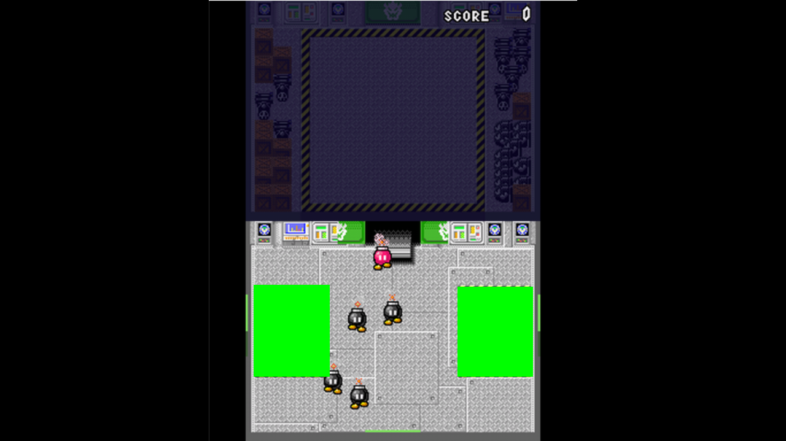

# NSMB Sort or 'Splode（ボムへいをわけろ）自動仕分けマクロ 仕様書

> **対象タイトル**: New スーパーマリオブラザーズ など、DS / 3DS 下画面タッチ操作で遊ぶ「Sort or 'Splode（ボムへいをわけろ）」  
> **目的**: 赤いボムへいと黒いボムへいを画像認識し、対応する陣地へタッチドラッグで仕分ける  
> **関連仕様**: [Nintendo 3DS 画面座標・プレビュータッチ 仕様書](../../agent/complete/local_007/NINTENDO_3DS_SCREEN_COORDINATES_AND_TOUCH.md)  
> **参考画像**: `../../../snapshots/20260516_200318.png`

## 1. 概要

### 1.1 目的

`Command.capture()` で取得した 3DS HD キャプチャ画像から下画面のボムへいを検出し、赤いボムへいを赤陣地、黒いボムへいを黒陣地へ自動でドラッグするマクロである。陣地内のボムへいを再検出しないよう、検出対象から陣地領域を除外する。

### 1.2 用語定義

| 用語 | 定義 |
|------|------|
| frame | 1/60 秒を 1 単位とする時間の最小単位 |
| 3DS HD キャプチャ座標 | `Command.capture()` が返す `1280x720` 画像上の座標 |
| 下画面実領域 | 3DS HD キャプチャ座標の `x=400, y=360, width=480, height=360` にあるタッチ可能な下画面 |
| タッチ座標 | 下画面実領域内の座標。左上を `(0, 0)`、右下ピクセルを `(319, 239)` とする |
| テンプレート | 赤いボムへい / 黒いボムへいを検出するための参照画像 |
| 検出マスク | テンプレートマッチングの対象外領域。実装では `cv2.rectangle()` により除外矩形を BGR `(0, 255, 0)` で塗りつぶす |
| 陣地領域 | ボムへいを投入する赤 / 黒の領域。検出マスクで必ず除外する |
| ドラッグ経路 | 検出中心から投入先座標まで、`touch_down()` を連続送信して移動する座標列 |

## 2. 対象ファイル

| ファイル | 変更種別 | 変更内容 |
|----------|----------|----------|
| `spec/macro/nsmb_sort_or_splode/spec.md` | 新規 | 本仕様書 |
| `spec/macro/nsmb_sort_or_splode/masked_preview.png` | 新規 | 除外矩形を緑で塗りつぶしたプレビュー |
| `macros/nsmb_sort_or_splode/__init__.py` | 新規 | マクロパッケージ初期化 |
| `macros/nsmb_sort_or_splode/config.py` | 新規 | 設定 dataclass と入力検証 |
| `macros/nsmb_sort_or_splode/recognizer.py` | 新規 | テンプレートマッチング、矩形マスク適用、座標変換 |
| `macros/nsmb_sort_or_splode/macro.py` | 新規 | メインマクロ。キャプチャ、検出周期制御、タッチドラッグを担当 |
| `resources/nsmb_sort_or_splode/settings.toml` | 新規 | 既定設定 |
| `resources/nsmb_sort_or_splode/assets/templates/red_bob_omb.png` | 新規 | 赤いボムへいの検出テンプレート |
| `resources/nsmb_sort_or_splode/assets/templates/black_bob_omb.png` | 新規 | 黒いボムへいの検出テンプレート |
| `tests/unit/macro/test_nsmb_sort_or_splode.py` | 新規 | 設定、認識、マクロ実行の単体テスト |

## 3. 設計方針

### アルゴリズム概要

下画面実領域だけを切り出し、赤テンプレートと黒テンプレートを `scan_interval_seconds = 0.10` 秒ごとに交互に照合する。照合前に赤陣地・黒陣地・スコア表示などの矩形を `cv2.rectangle(frame, pt1, pt2, (0, 255, 0), thickness=-1)` で塗りつぶし、ボムへいの投入先や誤検出源をテンプレートマッチングから除外する。

座標変換は 3DS 画面座標仕様に従う。実装では `THREEDS_HD_BOTTOM_SCREEN`、`ScreenPoint`、`ScreenRect`、`TouchPoint`、`hd_capture_point_to_3ds_touch()`、`touch_point_to_3ds_hd_capture()`、`validate_3ds_touch_point()` を使い、手書きの座標補正を増やさない。3DS HD キャプチャ座標 `(hd_x, hd_y)` からタッチ座標 `(touch_x, touch_y)` への変換式は確認用に以下で表せる。

```text
touch_x = floor((hd_x - 400 + 0.5) * 320 / 480)
touch_y = floor((hd_y - 360 + 0.5) * 240 / 360)
```

検出したテンプレート矩形の中心をタッチ座標へ変換し、色に対応する投入先へ直線補間でドラッグする。

```text
path_i = start + (goal - start) * i / drag_steps
```

`i = 0..drag_steps` の各点に対して `cmd.touch_down(x, y)` を送信し、最後に `cmd.touch_up()` を送信する。3DS プロトコルでは押下中の `touch_down()` 再送信を移動として扱う。

### 検出領域と矩形マスク

既定値は `snapshots/20260516_200318.png` を基準にした初期値であり、実装時に `settings.toml` から調整可能にする。

| 項目 | 3DS HD キャプチャ座標 | タッチ座標 | 用途 |
|------|----------------------|------------|------|
| 下画面実領域 | `(400, 360, 480, 360)` | `(0, 0, 320, 240)` | キャプチャ切り出し対象 |
| 赤陣地除外領域 | `(414, 466, 123, 150)` | `(9, 70, 82, 100)` | 赤陣地内の再検出防止 |
| 黒陣地除外領域 | `(745, 468, 122, 147)` | `(230, 72, 82, 98)` | 黒陣地内の再検出防止 |
| 赤投入先 | `(475, 543)` | `(50, 122)` | 赤いボムへいのドラッグ終点 |
| 黒投入先 | `(805, 543)` | `(270, 122)` | 黒いボムへいのドラッグ終点 |

検出対象外領域は設定値の矩形として持つ。矩形はタッチ座標で指定し、`touch_point_to_3ds_hd_capture()` と `THREEDS_HD_BOTTOM_SCREEN` により下画面切り出し後の `480x360` 座標へ変換してから `cv2.rectangle()` で BGR `(0, 255, 0)` に塗りつぶす。

### 性能要件

| 指標 | 目標値 |
|------|--------|
| 検出周期 | 100 ms ごとに赤 / 黒を交互に 1 回照合 |
| 1 回の画像処理 | 下画面切り出し、マスク適用、テンプレートマッチングを 80 ms 未満で完了 |
| ドラッグ時間 | 1 個あたり `0.18` 秒以内を既定値にする |
| 検出対象 | 陣地領域を除く下画面実領域 |
| 誤投入抑制 | しきい値未満、またはしきい値からのスコア余裕が小さい場合はタッチ操作しない |

### レイヤー構成

| レイヤー | ファイル | 責務 |
|----------|----------|------|
| 設定 | `config.py` | TOML / args 由来の値を frozen dataclass に変換し、範囲検証する |
| 認識 | `recognizer.py` | `numpy.ndarray` とテンプレート画像から検出候補を返す純粋関数群 |
| 実行 | `macro.py` | `Command.capture()`、`Command.touch_down()`、`Command.touch_up()`、ログ、通知を扱う |
| リソース | `resources/nsmb_sort_or_splode/` | テンプレートと既定設定を保持する |

画像認識と座標計算は `Command` に依存しない純粋関数として実装する。副作用は `macro.py` の `run()` とタッチドラッグ関数に集約する。

### 状態遷移

| 状態 | 処理 | 遷移条件 |
|------|------|----------|
| `WAITING` | 次の検出周期まで待機 | 周期到達で `CAPTURING` |
| `CAPTURING` | `Command.capture()` でフレーム取得 | 取得成功で `DETECTING`、失敗で停止 |
| `DETECTING_RED` | 赤テンプレートを照合 | 候補ありで `DRAGGING`、なしで `WAITING` |
| `DETECTING_BLACK` | 黒テンプレートを照合 | 候補ありで `DRAGGING`、なしで `WAITING` |
| `DRAGGING` | 検出中心から投入先へドラッグ | `touch_up()` 完了で `POST_DROP_WAIT` |
| `POST_DROP_WAIT` | 短時間待機して次色へ切替 | 待機完了で `WAITING` |
| `STOPPED` | マクロ終了 | ユーザー中断、最大仕分け数到達、致命的エラー |

### 再利用性・依存設計

3DS 座標変換は `nyxpy.framework.core.constants` の `THREEDS_HD_BOTTOM_SCREEN`、`THREEDS_TOUCH_SIZE`、`ScreenPoint`、`ScreenRect`、`TouchPoint`、`hd_capture_point_to_3ds_touch()`、`touch_point_to_3ds_hd_capture()`、`cropped_hd_point_to_3ds_touch()`、`validate_3ds_touch_point()` を利用する。`macros/shared/image_utils.crop_and_pad()` は OCR 向けの白パディング処理であり、本マクロのテンプレートマッチングには使用しない。

テンプレートマッチング処理は当面 `macros/nsmb_sort_or_splode/recognizer.py` に閉じる。別マクロで同じ矩形マスク付きテンプレート照合が必要になった時点で、`Command` に依存しない関数として `macros/shared/` へ抽出する。

依存方向は以下に限定する。

```text
macros/nsmb_sort_or_splode/ -> nyxpy.framework.*
macros/nsmb_sort_or_splode/ -> macros/shared/*     # 必要になった場合のみ
macros/nsmb_sort_or_splode/ -> macros/other/*      # 禁止
```

## 4. 実装仕様

### 設定パラメータ

| パラメータ | 型 | デフォルト | 説明 |
|------------|-----|-----------|------|
| `scan_interval_seconds` | `float` | `0.10` | テンプレート照合周期。赤 / 黒を交互に照合する |
| `post_drop_wait_seconds` | `float` | `0.02` | ドラッグ完了後の短期待機 |
| `max_sorted_count` | `int` | `0` | 仕分け数の上限。`0` は無制限 |
| `red_template_path` | `str` | `"templates/red_bob_omb.png"` | 赤いボムへいのテンプレートパス |
| `black_template_path` | `str` | `"templates/black_bob_omb.png"` | 黒いボムへいのテンプレートパス |
| `mask_fill_bgr` | `list[int]` | `[0, 255, 0]` | 除外矩形を塗りつぶす BGR 色 |
| `match_method` | `str` | `"TM_CCOEFF_NORMED"` | OpenCV のテンプレートマッチング方式 |
| `red_match_threshold` | `float` | `0.82` | 赤テンプレートの採用しきい値 |
| `black_match_threshold` | `float` | `0.82` | 黒テンプレートの採用しきい値 |
| `min_score_margin` | `float` | `0.05` | 最高スコアが `threshold + min_score_margin` 未満なら操作しない |
| `duplicate_suppression_radius` | `int` | `18` | 同一ボムへい候補をまとめる半径。単位はタッチ座標 px |
| `drag_steps` | `int` | `8` | 1 回のドラッグで送信する中間点数 |
| `drag_duration_seconds` | `float` | `0.18` | 1 回のドラッグ総時間 |
| `red_goal_touch` | `list[int]` | `[50, 122]` | 赤いボムへいの投入先タッチ座標 |
| `black_goal_touch` | `list[int]` | `[270, 122]` | 黒いボムへいの投入先タッチ座標 |
| `ignore_touch_rects` | `list[list[int]]` | `[[9, 70, 82, 100], [230, 72, 82, 98]]` | テンプレート照合から除外する矩形。単位はタッチ座標 |
| `save_debug_frames` | `bool` | `False` | 検出結果のデバッグ画像を artifacts に保存する |
| `notify_on_finish` | `bool` | `True` | 上限到達または中断時に通知する |

### リソース形式

```toml
# resources/nsmb_sort_or_splode/settings.toml
scan_interval_seconds = 0.10
post_drop_wait_seconds = 0.02
max_sorted_count = 0

red_template_path = "templates/red_bob_omb.png"
black_template_path = "templates/black_bob_omb.png"
mask_fill_bgr = [0, 255, 0]

match_method = "TM_CCOEFF_NORMED"
red_match_threshold = 0.82
black_match_threshold = 0.82
min_score_margin = 0.05
duplicate_suppression_radius = 18

drag_steps = 8
drag_duration_seconds = 0.18
red_goal_touch = [50, 122]
black_goal_touch = [270, 122]
ignore_touch_rects = [
  [9, 70, 82, 100],
  [230, 72, 82, 98],
]

save_debug_frames = false
notify_on_finish = true
```

テンプレート画像は下画面切り出し後の `480x360` スケールに合わせる。初期テンプレートは `snapshots/20260516_200318.png` から暫定的に切り出した画像であり、実機の照明・拡大率・キャプチャ条件で認識が不安定な場合は同名ファイルを上書きする。検出マスク画像は置かず、除外矩形を OpenCV で直接塗りつぶす。

除外矩形を緑で塗りつぶした確認用画像を以下に示す。



### インターフェース

```python
from dataclasses import dataclass
from enum import StrEnum
from pathlib import Path

import numpy as np
from nyxpy.framework.core.constants import TouchPoint


class BombColor(StrEnum):
    RED = "red"
    BLACK = "black"


@dataclass(frozen=True, slots=True)
class TouchRect:
    x: int
    y: int
    width: int
    height: int


@dataclass(frozen=True, slots=True)
class NsmbSortOrSplodeConfig:
    scan_interval_seconds: float
    post_drop_wait_seconds: float
    max_sorted_count: int
    red_template_path: Path
    black_template_path: Path
    mask_fill_bgr: tuple[int, int, int]
    match_method: str
    red_match_threshold: float
    black_match_threshold: float
    min_score_margin: float
    duplicate_suppression_radius: int
    drag_steps: int
    drag_duration_seconds: float
    red_goal_touch: TouchPoint
    black_goal_touch: TouchPoint
    ignore_touch_rects: tuple[TouchRect, ...]
    save_debug_frames: bool
    notify_on_finish: bool

    @classmethod
    def from_args(cls, args: dict) -> "NsmbSortOrSplodeConfig":
        """args と settings.toml の値を検証済み設定へ変換する。"""
        ...


@dataclass(frozen=True, slots=True)
class DetectedBomb:
    color: BombColor
    score: float
    hd_center_x: int
    hd_center_y: int
    touch_x: int
    touch_y: int
    width: int
    height: int


def paint_ignored_rects(
    frame_bgr: np.ndarray,
    ignore_touch_rects: tuple[TouchRect, ...],
) -> np.ndarray:
    """除外矩形を BGR (0, 255, 0) で塗りつぶした照合用フレームを返す。"""
    ...


def find_bombs(
    frame_bgr: np.ndarray,
    template_bgr: np.ndarray,
    *,
    color: BombColor,
    threshold: float,
    min_score_margin: float,
) -> list[DetectedBomb]:
    """下画面実領域から指定色のボムへい候補をスコア降順で返す。"""
    ...


def build_drag_path(
    start: TouchPoint,
    goal: TouchPoint,
    *,
    steps: int,
) -> tuple[TouchPoint, ...]:
    """開始点と終点を含む直線ドラッグ経路を生成する。"""
    ...
```

### メインフロー

**Step 0**: 初期化  
- `initialize(cmd, args)` で `NsmbSortOrSplodeConfig` を生成する。
- テンプレート画像を読み込む。ファイルがない場合は `FileNotFoundError` として停止する。
- 下画面実領域、投入先、除外矩形がタッチ座標範囲内であることを検証する。

**Step 1**: 検出ループ開始  
- タイミング: `scan_interval_seconds = 0.10` 秒。
- `active_color` の初期値は `red` とし、各周期で `red -> black -> red` の順に切り替える。

**Step 2**: 画面取得  
- `cmd.capture()` で `1280x720` のフレームを取得する。
- `THREEDS_HD_BOTTOM_SCREEN` に従って下画面実領域を切り出す。
- フレームサイズが想定外の場合はログ出力後に停止する。座標を推測補正して続行しない。

**Step 3**: テンプレート照合  
- `active_color` に対応するテンプレートだけを照合する。
- `paint_ignored_rects()` で陣地領域を BGR `(0, 255, 0)` に塗りつぶしたフレームを照合する。
- 最高スコアが色別しきい値未満の場合は操作しない。
- 最高スコアが `threshold + min_score_margin` 未満の場合は、誤投入回避のため操作しない。

**Step 4**: ドラッグ  
- 検出中心をタッチ座標へ変換する。
- 色に応じて `red_goal_touch` または `black_goal_touch` を選ぶ。
- `build_drag_path()` で経路を作り、各点で `cmd.touch_down(x, y)` を送る。
- 点間待機は `drag_duration_seconds / drag_steps` 秒とする。
- 最後に必ず `cmd.touch_up()` を送る。

**Step 5**: 後処理  
- `post_drop_wait_seconds` だけ待機する。
- `sorted_count` を加算する。
- `save_debug_frames = true` の場合、検出矩形とドラッグ先を描画した画像を artifacts に保存する。

**Step 6**: 終了判定  
- `max_sorted_count > 0` かつ `sorted_count >= max_sorted_count` なら終了する。
- ユーザー中断時は `Command` のキャンセル処理に従い停止する。
- 終了時に `notify_on_finish = true` なら仕分け数を通知する。

### タッチ操作の安全条件

- 候補が矩形マスク除外領域にある場合は操作しない。
- 投入先座標がタッチ範囲外の場合は初期化時に `ValueError` とする。
- `touch_down()` 後に例外が発生した場合でも、`finally` で `touch_up()` を送る。
- 認識できないフレームや設定不備を正常終了扱いにしない。ログへ理由を出し、例外として停止する。

## 5. テスト方針

| テスト種別 | テスト名 | 検証内容 |
|------------|----------|----------|
| ユニット | `test_config_accepts_default_settings` | 既定 TOML から `NsmbSortOrSplodeConfig` を生成できる |
| ユニット | `test_config_rejects_invalid_touch_goal` | 範囲外の投入先座標を `ValueError` にする |
| ユニット | `test_paint_ignored_rects_uses_green_bgr` | 除外矩形が BGR `(0, 255, 0)` で塗りつぶされる |
| ユニット | `test_paint_ignored_rects_converts_touch_rects` | 赤 / 黒陣地矩形が下画面切り出し後座標へ変換される |
| ユニット | `test_hd_center_to_touch_point_uses_3ds_constants` | HD 座標からタッチ座標への変換が 3DS 画面仕様と一致する |
| ユニット | `test_find_bombs_returns_best_match` | 合成画像に置いたテンプレート候補をスコア降順で返す |
| ユニット | `test_find_bombs_rejects_low_score` | しきい値未満の候補を返さない |
| ユニット | `test_find_bombs_rejects_low_confidence_margin` | しきい値からの余裕が小さい候補を返さない |
| ユニット | `test_build_drag_path_includes_start_and_goal` | ドラッグ経路が開始点と終点を含み、点数が設定通りになる |
| ユニット | `test_macro_alternates_red_and_black_detection` | fake `Command` で赤 / 黒の照合順が 100 ms 周期で交互になる |
| ユニット | `test_macro_sends_touch_drag_for_detected_bomb` | 検出時に `touch_down()` 群と `touch_up()` が送信される |
| ユニット | `test_macro_touches_up_when_drag_fails` | ドラッグ中の例外でも `touch_up()` が送信される |
| 実機 | `test_nsmb_sort_or_splode_realdevice` | 3DS 実機または DS 互換環境で赤 / 黒の仕分けが成功する |

## 6. 実装チェックリスト

- [x] spec.md 作成
- [x] settings.toml 作成
- [x] 暫定テンプレート画像作成
- [x] config.py 実装
- [x] recognizer.py 実装
- [x] macro.py 実装
- [x] 共通部品の抽出・既存部品の再利用確認
- [x] ユニットテスト作成・パス
- [ ] 実機動作確認
